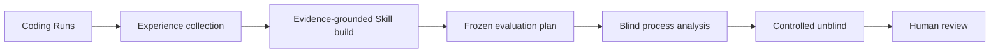

# Agent Eval & Skill Optimization Workbench

一个基于 public Direct Pi `AgentHarness` 的 artifact-first Coding Agent 评测与 Skill 改进工作台。

它把 Coding Run 固化为可核查的 Session、Trace、Diff、External Verifier 和 Manifest；从显式选择的有效 Run 证据构建 Candidate Skill；再通过冻结的对照评测、盲态过程分析、受控揭盲和人工审阅边界判断是否存在足够的改进证据。

```yaml
release: Analysis Agent v2.1
product_commit: 09681da3e80728f91adfd54c8bc5c2c2abf75345
runtime: Node.js >=22.19.0 / TypeScript
pi_commit: 027a5847901b5dde30270abaa1041046cd2b4b55
pi_core_patches: 0
swe_bench_external_evaluation: not_included
```

## 核心工作流



Canonical CLI 提供五个稳定入口：

```text
workbench task run
workbench experience run
workbench skill build
workbench evaluation run
workbench evaluation review
```

- `task run`：运行一个隔离 Coding Task，保存完整 artifact 并执行外部 Verifier。
- `experience run`：按调用者给定顺序收集多个 Run；合法 task failure 保留为证据，不自动重试。
- `skill build`：仅从显式选择的、证据有效的 passed/failed Runs 构建一个 Candidate Skill；证据不足是合法终态。
- `evaluation run`：执行已冻结的 Evaluation Plan，不在运行中改写实验设计。
- `evaluation review`：不重跑 Coding Agent，只使用既有 Evaluation artifacts 重新分析。

Agent-facing 操作纪律位于 [`skills/workbench-orchestration/`](skills/workbench-orchestration/)。CLI 是执行权威，artifact 是结果权威，Skill 不构成第二套执行面。

## 快速开始

### 前置条件

- Git
- Node.js `>=22.19.0`
- npm
- 可访问固定的 Pi 上游仓库

安装步骤不会读取模型 Credential，也不会执行真实模型请求。

```powershell
cd workbench
npm run setup
$env:PI_RUNTIME_ROOT = (Resolve-Path ../.runs/v0-a/pi).Path
npm run setup:check
npm run workbench -- --help
```

POSIX shell：

```bash
cd workbench
npm run setup
export PI_RUNTIME_ROOT="$(cd ../.runs/v0-a/pi && pwd)"
npm run setup:check
npm run workbench -- --help
```

`npm run setup` 会把 Pi 源码精确固定在 `027a5847901b5dde30270abaa1041046cd2b4b55`，通过独立 lockfile 和禁用 lifecycle scripts 的 `npm ci` 安装最小 runtime dependencies，校验并展开与该版本对应的 immutable npm `0.82.1` Pi AI/Agent 发布产物，再安装 Workbench 依赖。生成内容位于被 Git 忽略的 `.runs/`。

查看各命令的输入和输出合同：

```powershell
npm run workbench -- task run --help
npm run workbench -- experience run --help
npm run workbench -- skill build --help
npm run workbench -- evaluation run --help
npm run workbench -- evaluation review --help
```

真实 Coding/Build/Analysis 命令需要调用者自行提供 DeepSeek Credential，可能产生外部请求和费用。不要把 Credential、`.env`、`.runs/` 或原始 Session 数据提交到 Git。

## 已验证证据

最终冻结实验包含一个 Candidate、三个 Case、两个 condition、每个 condition 三次 trial，共 18 Runs：

- 17 `PASS`
- 1 `TASK_FAILURE`
- 0 `INFRA_FAILURE`
- 0 `INVALID_TRIAL`
- `no_skill` 为 8/9 PASS，`with_skill` 为 9/9 PASS

这个小样本结果不证明 Skill 有效或具有因果改善。最终 Analysis 的两条 Finding 均为 `benefit=UNPROVEN`、`causation=UNSUPPORTED`、`NO_CHANGE_JUSTIFIED`，流程停在 `human_review_ready`。项目强调的是证据治理和拒绝不充分结论，而不是把一次结果包装为自动自进化。

发布事实、范围和验证入口见 [Analysis Agent v2.1 Release](docs/releases/ANALYSIS_AGENT_V2_1.md)。历史架构与逐阶段 Closeout 保留在 [`docs/`](docs/)。

## 边界与非声明

本发布可以声明：

- public Direct Pi `AgentHarness` 集成，Pi Core 零 patch；
- 隔离 Workspace、External Verifier、可追踪 Run artifacts；
- 显式 Source Run 选择和 evidence-grounded Candidate construction；
- Frozen Plan、Thin Mapping、blind/sealed/controlled-unblind Analysis；
- canonical CLI 与 Agent-facing orchestration Skill；
- 一个冻结 18-Run fixture 的完整工程证据。

本发布不声明：

- 通用或统计显著的 Skill 提升；
- autonomous self-improvement；
- production sandbox、多租户或分布式 Eval 平台；
- 任意仓库、模型或 Provider 的普适兼容；
- SWE-bench 支持。

SWE-bench external-evaluation adapter 位于后续独立实验分支，尚未完成，因此没有进入本发布。

## 仓库卫生

以下内容不会进入版本控制：

- `.runs/`：生成的运行、runtime 和证据；
- `.upstream/`：本地上游 checkout；
- `.env*`：Credential 和本地配置，只有 `.env.example` 被跟踪；
- `node_modules/`、构建输出和覆盖率文件。

安全问题请遵循 [SECURITY.md](SECURITY.md)。项目所有者尚未选择开源许可证；在加入明确 LICENSE 前，本仓库不授予复制、修改或再分发许可。
