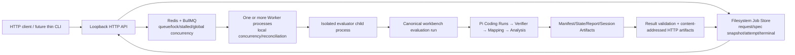

# Skill Evaluation Job Service V1 Backend Completion SPEC

**状态：** Approved / 2026-09-24 用户授权实施  
**调查日期：** 2026-09-24  
**适用分支：** `codex/skill-evaluation-job-service`  
**调查时 HEAD：** `603207f20436b1c31f67c3234936a9636f1d5c13`  
**调查时 Tree：** `edc44fc90b52f7ea2ff4ef20b384e0bd8404f7a3`  
**目标：** 补齐真实双 Job 并发、统一 HTTP 使用入口、可靠性定向巩固和可复现 Git 交付；不改变正式 Evaluation 语义。

> 本文件原为下一阶段实施合同草案。用户与 Web GPT 已完成审核，用户于 2026-09-24 授权在补入三个合同澄清后，直接按阶段 1 → 2 → 3 → 4 实施。该授权包含阶段 1 固定的两个真实 Job 和阶段 4 本地 commit；不包含真实并发 4/8、merge 或 push。

> **2026-09-24 Stage 1 处置修订：** 当前已提交源码身份为 commit `1662c6a5a761ac68189076bc895e95bb5d050f21`、tree `aae9a17f9e99ac24235399a466c66f648e233cf8`。真实 HTTP 双 Job 已证明 evaluator、Coding Run、Analysis 活跃区间重叠以及 Workspace/Mapping/Artifact 隔离；直连网络下复用各自既有 Run/Mapping 的双 Analysis-only Review 均到达 `human_review_ready`。但没有一组两个全新 HTTP Job 同时完整到达正式 State/Report，因此该项仍标记为 **未验证**，不得拼接跨尝试证据或宣称完整双 HTTP E2E 已通过。用户接受将其作为已披露的 Provider 长流网络路径限制延期处理，并授权继续 Stage 2 → 3 → 4；本修订不等于追认原失败 Job 成功。

## 1. 证据口径与范围

本文按以下标签区分结论：

- **Fact（事实）：** 已由当前源码、配置、测试或落盘 Artifact 直接确认。
- **Inference（推断）：** 由多项事实支持，但仍需实施期观测确认。
- **Recommendation（建议）：** 拟采用的最小实现或验证方法。
- **Unconfirmed（未确认）：** 当前没有足够的真实证据。

实施时继续遵循 Workbench 正式合同：Frozen Plan 不在执行中改写；`workbench evaluation run` 是正式 Evaluation 执行入口；Manifest、Mapping、Analysis State、Report 等落盘产物是结果依据，BullMQ ACK 不是 Evaluation 成功依据。

### 1.1 本阶段明确包含

1. 复用同一合法小型 Frozen Evaluation Spec，经正式 HTTP API 提交两个独立真实 Job，并证明两个 Evaluation 的实际执行区间重叠。
2. 增加一个只调用现有 HTTP API 的薄 CLI 客户端，使用户和 Codex 使用同一入口。
3. 对现有可靠性边界做缺口导向的确定性回归；不重建队列或恢复平台。
4. 在独立分支形成可复现的本地提交、启动说明和持续实施记录。

### 1.2 明确不包含

- 不研究 Skill 收益、因果效果、placebo/generic 对照、holdout 或 Benchmark 泛化。
- 不改变 Analysis Agent、Frozen Plan、Evaluation Outcome、Finding 或 controlled-unblind 合同。
- 不重写 Evaluation CLI、Agent Loop、Pi、Verifier、Mapping 或 Artifact 体系。
- 不增加 Spring Boot、数据库、Kubernetes、微服务、完整网站或新的通用调度/恢复框架。
- 真实并发只验证 **2**；不执行真实并发 4 或 8。
- 不把 fake 吞吐或一次 Windows 单机实验宣称为生产级容量、跨机器调度或高可用。

## 2. 当前基线与源码现状

### 2.1 Git 与执行身份

**Fact：** 当前工作树位于独立分支 `codex/skill-evaluation-job-service`，Git HEAD 仍是便携发布基线 commit `603207f20436b1c31f67c3234936a9636f1d5c13`，该 commit 的 tree 是 `edc44fc90b52f7ea2ff4ef20b384e0bd8404f7a3`。服务 V1 源码、测试、报告和配置目前存在未提交改动/未跟踪文件。`.env.*`、`.runs/` 等运行材料受忽略规则保护。

**合同澄清——四层源码身份必须分开：**

1. `603207...` / `edc44f...` 只表示现有便携发布基线的已提交 HEAD/tree；它不包含当前工作树中的未提交服务与 Analysis 修改。
2. 阶段 1 使用的是当前实际工作树源码。由于 dirty worktree 没有独立 Git tree 身份，其精确执行身份由基线 HEAD/tree、注册 Spec 固定的 Plan/config/input 摘要，以及逐文件 executor path + SHA-256 清单共同描述；不得把 `edc44f...` 单独称为当前全部源码身份。
3. 阶段 4 本地 commit 后，将产生新的最终 commit/tree；这是已提交交付源码身份，必须与旧便携基线分列记录。
4. 最终 commit 之后必须重新生成注册 Spec，并以新的 commit/tree、executor digests 和输入摘要通过零模型 preflight。修改后源码不得套用旧 Spec，也不得用阶段 1 的 dirty-worktree Spec 冒充最终交付 Spec。

**Fact：** `formal_cli` Spec 不是松散命令模板。`workbench/src/evaluation-service/registry.ts` 的 `validateFormalSpecFiles()` 会验证预期 Git commit、tree、Plan/配置 SHA-256 和 executor source digest；源码或最终 commit 改变后，旧 Spec 不能继续作为相同执行身份使用。

**Recommendation：** 阶段 1 在当前已核对源码身份上运行；阶段 4 的最终本地 commit 完成后，必须重新生成并零模型 preflight 一个交付身份 Spec。最终提交之后不得再修改受 digest 约束的源码并继续声称身份相同。

### 2.2 实际架构与责任边界



职责不是一层混合实现：

| 层 | 当前实现与真实职责 | 不承担的职责 |
|---|---|---|
| HTTP | `api.ts`；校验请求、列 Spec、异步提交、查询状态/结果/Artifact；只监听 `127.0.0.1` | 不等待整个 Evaluation，不执行 Agent |
| Spec Registry | `registry.ts`；只允许注册且启用的 Spec，固定 Plan/config/source 身份 | 不接收客户端任意路径、命令、环境变量或 Credential |
| Queue | Redis/BullMQ；排队、锁、stalled 检测、局部/全局并发协调 | 不作为正式评测结果数据库，不承诺 exactly-once |
| Job Store | `job-store.ts`；文件系统幂等索引、request、Spec snapshot、attempt/launch、terminal | 不替代 Evaluation Artifact |
| Worker | `worker.ts`；领取 Job、校验身份、解析私有 Credential、启动/对账/终止子进程、写 terminal | 不重写 Evaluation 状态机 |
| Child adapter | `evaluation-job-child.ts`；以受控参数调用 `workbench evaluation run`，流式记录日志 | 不复制 Pi/Verifier/Analysis 实现 |
| Evaluation | `evaluate-evaluation.ts` 及既有 Review 链；按 Frozen Plan 顺序执行 Planned Runs，再 Mapping/Analysis/Report | 单个 Evaluation 内不并行 Planned Runs |
| Result validation | `result-validation.ts`；核验 `human_review_ready`、Mapping、State、Report、引用关系并发布 Artifact 元数据 | 不以队列 completed 替代正式结果 |

### 2.3 当前 HTTP 合同

**Fact：** 当前真实路由如下；没有独立的通用 HTTP 客户端，也没有批量提交路由。

| 方法与路由 | 当前用途 |
|---|---|
| `GET /health` | API/Redis 健康状态 |
| `GET /v1/evaluation-specs` | 列出允许提交的注册 Spec |
| `POST /v1/evaluation-jobs` | 提交 `{kind, evaluation_spec_id, idempotency_key}` |
| `GET /v1/evaluation-jobs/:jobId` | 查询 Job、队列与文件系统终态投影 |
| `GET /v1/evaluation-jobs/:jobId/result` | 查询经过校验的正式结果；未就绪返回 pending |
| `GET /v1/evaluation-jobs/:jobId/artifacts/:name` | 按已发布名称读取并重新校验文件、字节数和 SHA-256 |

`POST` 只接受精确 Schema；同一 idempotency key 和同一 payload 返回同一 Job 并标明去重，同一 key 配不同 Spec 返回冲突。Job ID 由服务端身份派生，客户端不能指定任意 Job 路径。

### 2.4 状态与结果的实际持久化位置

**Fact：** Redis/BullMQ 保存排队、active、lock、stalled 等协调状态；正式 Job 和 Evaluation 证据主要在文件系统：

```text
<jobsRoot>/
  submissions/<key-hash>.json
  jobs/<job-id>/
    request.json
    spec-snapshot.json
    queue-receipt.json
    attempt-1/
      launch-0001/
        reservation.json / dispatch.json / child-terminal.json / logs...
        evaluation-output/... Manifest / Mapping / Analysis State / Reports...
    terminal.json
```

HTTP 状态会组合文件系统 terminal 与可获得的 BullMQ 状态。正式结果必须通过 `result-validation.ts` 的交叉校验；Artifact HTTP 响应还会复核普通文件、大小和摘要。

### 2.5 并发、进程与 Credential

**Fact：** `config.ts` 将 Worker 本地并发和队列全局并发分别配置为：

- `EVALUATION_SERVICE_WORKER_CONCURRENCY`，默认 `1`；
- `EVALUATION_SERVICE_GLOBAL_CONCURRENCY`，默认 `2`。

`api.ts` 和 `worker.ts` 都向 BullMQ 设置全局并发；Worker 自身使用本地 `concurrency`。这两个值没有在业务代码中永久写死为 2。

**Fact：** Worker 从独立 Credential Registry 解析 Credential profile；Job Data、HTTP 请求和公开 Spec 不携带密钥。Credential 文件路径通过私有子进程环境传递后被移除。`bounded-log.ts` 对流式日志做有界保存和跨 chunk secret 脱敏，不使用会因小 `maxBuffer` 杀死正常 Evaluation 的一次性缓冲。

**Fact：** post-dispatch redelivery 不会无条件再次 spawn。Worker 会先对账既有 launch、PID/命令身份和 Artifact；不能确认安全时写 `uncertain_requires_review`。Windows 当前通过进程身份检查和 `taskkill /T /F` 处理进程树；无法确认清理时不会写成 cleanup complete。

## 3. 已有证据与仍待验证项

### 3.1 已有并直接复用的能力

| 能力 | 已有证据 | 本轮处置 |
|---|---|---|
| HTTP → BullMQ → Worker → evaluator 闭环 | 服务核心测试与 Faux 测试 | **复用/定向回归** |
| HTTP 幂等与参数冲突 | Job Store 和 HTTP 核心测试 | **复用/定向回归** |
| 合法 `TASK_FAILURE` 与服务故障分层 | 核心测试；正式结果可包含 Run 失败 | **复用/验证** |
| Worker crash 后 stalled redelivery 保护 | crash 测试证明仅一个 launch，之后清理或 uncertain | **复用/定向回归** |
| Job timeout 与嵌套后代清理 | 核心测试覆盖 timeout/nested process | **复用/定向回归** |
| Credential 不进 Redis/HTTP/公开 Artifact，日志脱敏 | credential-leak 测试 | **复用/定向回归** |
| Redis 不可用时 health/submit 降级 | Redis-unavailable 测试 | **复用/补充查询场景** |
| Faux 两 Run、Verifier、Mapping、Analysis、Report | Faux service test，零模型访问 | **复用/回归** |
| fake 并发 1/2/4/8 | capacity Artifact 观测到对应最大 overlap | **保留证据，不冒充真实容量** |
| 100 个 fake Job | 100/100 完成，约 23.74 fake Jobs/s 的一次本机记录 | **保留证据，不作为真实 Agent 吞吐** |
| 单个真实完整 HTTP Job | Job `e45998...e488` 完成两 Run、Verifier、Mapping、Analysis State、controlled-unblind 和报告 | **保留/作为 Stage 1 对照** |
| Analysis timeout 可配置并实际传递 | Spec 字段、child adapter 和真实 E2E 300 秒配置 | **复用，不改变预算语义** |

现有单 Job 真实成功的时间证据还确认了可用于 Stage 1 的观测来源：launch reservation、`dispatch.json`、`child-terminal.json`、每个 Run Manifest 以及 Analysis Invocation/Session 均有开始或结束时间。历史 Closeout 中“真实 Analysis 尚未完成”的旧描述已被 `SKILL_EVALUATION_JOB_SERVICE_V1_REAL_E2E_VALIDATION_2026-09-23.md` 的后续成功证据取代。

### 3.2 当前确实缺少的证据或产品入口

| 缺口 | 类型 | 说明 |
|---|---|---|
| 两个真实 HTTP Evaluation 同时 active | **2026-09-25 已验证** | 两个新 HTTP Job 的 evaluator、两对 Coding Run 和 Blind Analysis 均有严格大于 0 的重叠 |
| 两个真实 Job 的目录、进程、Run、Mapping、State、Report 互不串线 | **2026-09-25 已验证** | 两个 Job 均完整到报告；Mapping、State covered Runs、Artifact 和根目录交叉核验通过 |
| 给用户和 Codex 共用的薄 HTTP CLI | **Stage 2 已实现** | `specs/submit/status/wait/result/artifact` 均由同一 loopback HTTP 客户端提供 |
| Redis 断开后查询一个已完成 Job 的 status/result/artifact | **Stage 3 已验证** | 文件系统正式结果保持可查，队列状态明确 degraded |
| Artifact 被落盘篡改后的 HTTP 409/拒绝路径 | **Stage 3 已验证** | 摘要不符时拒绝并返回 409 |
| 小规模两 fake Job 的并发隔离回归测试 | **Stage 3 已实现** | 常规回归证明两个延迟 fake Job 的执行区间重叠，且 launch token、Job root、terminal 与 Artifact 路径隔离 |
| 服务与客户端的可追溯本地 Git 身份 | **Stage 4 已交付** | 后端工具 commit `9430615...`；本次双 HTTP 验收合同/执行身份为 `b72df11...` |

### 3.3 Stage 1 后续证据与当前处置

**Fact：** 三组后续证据需要分开解释：

- 原真实 HTTP 双 Job 已取得约 190 秒 evaluator 重叠、两对跨 Job Coding Run 重叠、四个通过的 Verifier 和互不交叉的 Mapping，但两个 Blind Analysis 在同一绝对时刻附近发生 headers 后流终止。
- JSON Mode 修复后的单次 controlled-unblind Canary 首次成功，证明已确认的 B 类 root JSON 结构问题已被定向修复；该修复不处理 Blind Analysis 传输终止。
- 绕过 Clash/TUN 的直连双 Analysis-only Review 均完整生成 State 和 Markdown/HTML/PDF 报告。这提高了代理/TUN 路径是故障贡献因素的可信度，但不能替代两个新 HTTP Job 的完整成功证据。

**User decision / accepted implementation route：** 不再为本轮 Stage 2–4 追加真实模型复测，也不实现 controlled-unblind 的 B 类降级/自动重试。Stage 1 的调度并发与隔离证据保留为有效工程证据；“完整双 HTTP E2E”保留为明确未验证边界。部署说明应提示长流 Provider 路径需要单独验证，但产品代码不切换系统代理、不把直连写死为业务规则。

### 3.4 2026-09-25 完整双 HTTP 验收重新开放

**User authorization：** 用户在 Stage 2–4 完成后，明确授权重新开放一次完整双 HTTP Job 验收。该授权只包含同一合法小型 Spec 下的一组、两个新 Job；不包含第三个 Job、失败后的真实重试、B 类降级、真实并发 4/8、merge 或 push。

本次重新开放继续完整复用第 4 节 Stage 1 的入口、并发、重叠、隔离、成功标准和异常暂停合同，并补充以下约束：

1. 先把本修订形成新的本地合同 commit，再重新生成绑定该 commit/tree 和 executor digests 的合法 Spec并通过零模型 preflight；不得套用旧源码身份。
2. 使用此前对照中已验证的直连 Provider 网络路径。服务代码不得操作系统代理、静默切换路由或加入自动 Provider 重试。
3. 使用薄 HTTP CLI 对同一 Spec提交两个不同 idempotency key；两个 Job 都必须是新的 Job/Attempt/output identity。
4. 任一 Job dispatch 后发生失败，不提交新 Job、不自动重跑 Analysis、不启用 B 降级；另一条合法运行中的 Job按既有生命周期收敛，随后同时核验两条现场。
5. 无论两个 Job最终成功或失败，本次固定双 Job收敛、证据核验和实施记录完成后均停止，等待用户审核。

成功仍严格要求两个新 HTTP Job 在各自独立身份下同时满足 `reason=completed`、正式 result 为 `human_review_ready`，并分别具备两 Run、Verifier、Mapping、正式 Analysis State、必要的 controlled-unblind、Markdown/HTML/PDF 报告和可读取的内容寻址 Artifact。Analysis-only、历史 Job或跨尝试产物不得拼接为本次成功。

### 3.5 2026-09-25 完整双 HTTP 验收结果

**Disposition：`PASS_FULL_DUAL_HTTP_EVALUATION_ACCEPTANCE`。** 在合同 commit `b72df11ae0f1d1cdafd8be0486cd7618f62960a5`、tree `81a82b9ef04b5f6c4b237c9c97aaccb2f8ee8303` 和匹配的 v9 Spec 下，唯一一组两个新 HTTP Job 均经 HTTP → Redis/BullMQ → 两个 Worker → Evaluation CLI 完成两 Run、Verifier、Mapping、正式 Analysis State 和报告，并以 `reason=completed`、`human_review_ready` 收敛。

- Job A：`8fd08a5e1c79f16f36275125a6bc49c9194f422049d9fce7c50774d4135b4479`。
- Job B：`06651f5449ae31d75e9df105e8149ba4361af0f5311ac3bdcfd002c717d81d12`。
- evaluator 重叠 `164686 ms`；两对 Coding Run 重叠 `5770 ms` / `3492 ms`；Blind Analysis 重叠 `129654 ms`。
- 四个 Coding Run 均 `completed/passed`；两份 Mapping 仅引用本 Job 的 Run，State `covered_runs` 与 Mapping 一致。
- Job A 保留 1 个 Finding并完成 1 次 controlled-unblind；Job B 保留 0 个 Finding，controlled 阶段为 0 Provider request。两者均合法到达 `human_review_ready`。
- A 的 15 个、B 的 14 个 HTTP Artifact 均通过状态、字节数、SHA-256 和响应摘要复核；两份 PDF magic 合法。
- 所有 runner/evaluator 退出，terminal `cleanup_confirmed=true`；Credential 精确值扫描 98/98 文件为 0 命中。

该 PASS 证明当前 Windows/直连网络路径上的单机真实并发 2 和完整正式合同，不扩张为生产高可用、真实并发 4/8、exactly-once、跨机器调度或所有代理/Provider 网络条件均可靠。

**Fact：** 初次调查时服务测试源码有 11 个 `test()` 定义；历史 Closeout 的 10/10 统计早于后续 timeout 用例。Stage 2/3 完成后，当前完整 `evaluation-service-*.test.ts` 套件为 18/18 通过，包含 5 个薄客户端测试、真实 loopback API 客户端闭环和两 fake Job 并发隔离回归。

## 4. 四阶段实施计划

四阶段原计划按 `1 → 2 → 3 → 4` 推进。Stage 1 的首次严格验收未通过；经上述 2026-09-24 用户处置修订，其并发/隔离部分作为有效证据保留，完整双 HTTP 成功项延期且不得宣称已验证，现授权从 Stage 2 继续。Stage 2–4 仍须逐阶段满足各自验收；第 7 节定义的任何新异常必须暂停。

### 阶段 1：真实双 Job 并发

#### 目标

通过正式 HTTP API，以同一个已成功的小型 Evaluation Spec 创建两个独立真实 Job，证明两个 evaluator 子进程和至少一个实际业务阶段有重叠，并核验完整结果隔离。

#### 入口与配置

- **复用/验证：** `prepare-evaluation-service-small-spec.ts` 生成合法的两 Run Frozen Spec；`preflight-evaluation-service-spec.ts` 在零模型、零 Credential 读取条件下验证执行边界。
- **复用/验证：** Spec 继续绑定同一 Plan、Candidate、两组 config、executor digest 和 300 秒 Analysis Provider request timeout；不降低模型、Token、thinking、Tool、Run 或 Job 预算。
- **复用/验证：** 使用全新的短 Windows `EVALUATION_SERVICE_JOBS_ROOT`、独立 queue 名/Redis DB、独立输出根和明确的 API 端口，避免污染历史 Job。
- **复用/验证：** 启动两个独立 Worker 进程，每个 `EVALUATION_SERVICE_WORKER_CONCURRENCY=1`，队列 `EVALUATION_SERVICE_GLOBAL_CONCURRENCY=2`。这既验证多 Worker，也避免一个 Worker 同时管理两个长 Evaluation；不是永久架构上限。
- **复用/验证：** 通过两个真实 `POST /v1/evaluation-jobs` 近同时提交相同 `evaluation_spec_id`，但使用两个不同且可审计的 `idempotency_key`。不同 key 必须产生不同 Job ID；不得用同 key 绕过去重，也不得增加服务端 batch route。

#### 重叠证明

不能把“两个请求同时收到”或“两个 Job 同时在队列”当成并发成功。验收记录至少计算以下区间：

1. 每个 Job 的 evaluator 生命周期：`dispatch.dispatched_at → child-terminal.finished_at`；两个区间交集必须严格大于 0。
2. 每个 Job 的实际业务阶段：Run Manifest 的 `started_at/finished_at`，以及 Analysis Invocation/Session 的起止时间；至少一对跨 Job 的 Coding Run 或 Analysis 区间交集必须严格大于 0。
3. BullMQ active 状态、Worker ready PID、launch token 和 evaluator PID 作为佐证；在没有持久化 worker-to-job 绑定证据时，不猜测某一 Job 必然由哪一个 Worker 执行。

#### 隔离与结果核验

两个 Job 分别验证：

- Job ID、idempotency key hash、Job root、attempt/launch token、evaluator PID、Run ID 均不同；
- 所有 Workspace、stdout/stderr、Session、Mapping、Analysis State 和 Report 位于自己的 Job/output 根；
- Mapping 只引用本 Job 的两 Run；Analysis `covered_runs`、controlled-unblind 和报告只引用本 Job 的 Mapping/Run；
- 每个 HTTP Artifact 都能按 metadata 读取，字节数和 SHA-256 一致，不出现跨根路径；
- 日志与公开 Artifact 的敏感信息扫描为零命中；Credential 不出现在 Job Data 或 Redis；
- 查询两个 Job 的 terminal、正式 result、Run outcome、Provider stop/error 和 usage，检查 429、timeout、transport error 或资源异常。

#### 业务失败与后端故障

- **合法业务结果：** Coding Task 或 Verifier 为 `TASK_FAILURE`，但 evaluator 正常完成 Mapping、正式 Analysis State 和 Report，Job terminal 仍可为 `completed`。这不阻塞 Stage 1。
- **后端故障：** `preflight_failed`、`execution_failed`、`timed_out_cleanup_complete`、`uncertain_requires_review`、`artifact_invalid`，或缺失正式 State/Report。任一均不满足 Stage 1。
- **Provider/模型异常：** 由 Session、stop reason、错误类型和 stderr 判断，不能从一个 terminal 字符串直接归因。

#### 验收标准

1. 两次 POST 获得两个不同 Job ID，均由正式 HTTP → Redis/BullMQ → Worker 链路处理。
2. 两个 evaluator 生命周期重叠，且至少一对真实 Coding/Analysis 活跃区间重叠。
3. 两个 Job 均以 `reason=completed` 且正式 result 为 `human_review_ready`；Run 可以是合法的业务成功或失败。
4. 每个 Job 都有两 Run、Verifier、Mapping、正式 Analysis State、必要的 controlled-unblind、Markdown/HTML/PDF 报告和可读取 Artifact。
5. 没有跨 Job 引用、目录串写、密钥泄露、未清理残留进程或未解释的 Provider/资源错误。

#### 预期产物

- 两个不可覆盖的 Job/Attempt 根及完整 Artifact；
- 实施记录中的配置、Job ID、Worker/PID、精确时间区间和 overlap 计算；
- 实际模型/timeout/预算/调用 usage 和成本记录。此前单 Job 约 19 次 Provider 请求、约 USD 0.013 只作为量级参考；两 Job 约 38 次/约 USD 0.026 是推算，不是硬上限或成功保证。

**停止边界：** 若发生非预期失败、Provider 限流、资源不足、身份不一致或隔离失败，保留两条现场，完成只读诊断后停止；不得自动修复或付费重试。

**合同澄清——一个 Job 失败而另一个仍在运行：**

1. 立即停止提交新 Job、自动付费重试和后续阶段推进，并冻结已知的 Job/Attempt/进程身份。
2. 两条 Job 的 request、queue、attempt、launch、terminal、日志和 Evaluation Artifact 均原样保留，不覆盖、不拼接、不回写。
3. 对仍合法运行的另一个 Job，优先遵守现有 Job deadline、Evaluation 生命周期和进程清理合同；“暂停”表示不再开启新实施动作，不等于为了形式上的立即停止而强杀正常任务。
4. 只有出现实际资源耗尽、Credential 风险、失控调用或其他必须终止的安全条件，才使用现有受控终止/进程树清理机制；清理是否确认必须如实落盘。
5. 现场稳定后分别核验两个 Job 的服务状态、Provider/Session、Artifact 和残留进程。一个 Job 后续成功不能抵消另一个 Job 的异常；完成第 5 节规定的故障交接后停止等待审核。

### 阶段 2：统一 HTTP 使用入口

#### 目标

提供一个很薄、可脚本化的 CLI，使用户和 Codex 都经同一 HTTP 合同提交和读取 Job；不复制 Evaluation 或调度逻辑。

#### 拟修改

- **新增/修改：** `workbench/scripts/evaluation-service-client.ts`。
- **新增/修改：** `workbench/package.json` 增加 `evaluation-service:client` 脚本。
- **新增/修改：** `workbench/tests/evaluation-service-client.test.ts`。
- **新增/修改：** `workbench/config/evaluation-service/README.md` 增加最简命令示例和退出码语义。
- **复用：** 现有 API 路由、Schema、幂等、result 和 Artifact；不新增服务端 batch API。

#### 最小命令面

```text
evaluation-service:client specs
evaluation-service:client submit --spec <id> --idempotency-key <key> [...重复 key]
evaluation-service:client status --job <id> [...重复 job]
evaluation-service:client wait --job <id> [...重复 job]
evaluation-service:client result --job <id> [...重复 job]
evaluation-service:client artifact --job <id> --name <name> --output <fresh-path>
```

约束与语义：

- 默认连接 loopback；若支持覆盖 base URL，只接受明确的 `http://127.0.0.1`/`localhost` 目标，不扩大当前网络暴露面。
- 输出稳定的 machine-readable JSON；错误输出不得包含 Credential、私有输入或整段服务日志。
- 多 Job 提交只是在客户端并发/顺序调用既有 POST；每个 Job 必须有显式、不同的 idempotency key。
- 相同 key/相同 payload 的 200 + `deduplicated=true` 是可见的成功去重；相同 key/不同参数的 409 是冲突并返回非零退出码。
- `status` 成功查询不等于 Evaluation 成功；`wait` 只有在全部 terminal reason 为 `completed` 时退出 0。合法 `TASK_FAILURE` 位于 completed 结果内，不应被客户端误判为后端失败。
- 服务不可用、5xx、轮询超时和后端 terminal 使用可区分的非零退出结果。
- `wait` 只轮询服务端状态；客户端等待超时、终端退出、信号中止或 Codex 停止等待，都不得隐式取消、删除或改变后台 Job。Job ID 必须保留，之后可继续用 `status`、`result` 和 `artifact` 查询。
- 本阶段不新增 Job cancel 路由或取消系统。客户端退出信息必须明确区分：本地等待超时/中止、HTTP/服务错误、正式 Job 基础设施失败、以及 completed Job 内的合法业务 `TASK_FAILURE`。
- Artifact 下载前读取 result metadata；拒绝覆盖已有输出，下载后核验字节数、SHA-256 和响应摘要。
- 客户端不能读取 Credential，不能直接运行 `workbench evaluation run`，不能自己维护队列状态。

#### 测试与验收

- 使用本地 fake API/真实 service fake Spec 测试参数、JSON、重复提交、冲突、pending、terminal、服务不可用和 Artifact 摘要。
- 同一套客户端完成一个或多个独立 Job 的 submit/status/wait/result/artifact 操作。
- README 示例从空环境变量集合开始，能清楚区分 Redis、API 和 Worker 三个进程。

#### 预期产物

薄客户端、聚焦测试、使用说明；不产生第二个 evaluator CLI 或新的服务端业务层。

### 阶段 3：可靠性巩固

#### 目标

针对真实源码和 Stage 1/2 变化补齐缺口，不机械重跑无关昂贵实验。

#### 分类与计划

| 关注点 | 当前分类 | 实施计划 |
|---|---|---|
| HTTP 幂等/参数冲突 | 已有通过 | 回归核心测试；客户端补语义测试 |
| Worker crash/stalled/redelivery | 已有通过 | 若 Worker/queue 未改，只回归现有 crash 测试 |
| Job timeout/后代清理 | 已有通过（当前 Windows） | 回归 timeout/nested 测试；不扩展通用跨平台 supervisor |
| Redis 不可用提交 | 已有通过 | 回归现有 503/health 测试 |
| Redis 不可用时查询已完成 Job | 后续修复已覆盖 | 复用确定性测试：断开 Redis 后 status/result/artifact 仍按文件系统合同读取；队列状态明确 degraded |
| Credential/日志/公开 Artifact | 已有通过 | 回归现有泄露测试；Stage 1 对两个真实根做无内容输出的命中统计 |
| Artifact 落盘篡改 | 后续修复已覆盖 | 复用确定性测试，确认摘要不符时拒绝/409 |
| 多 Job 文件与状态一致性 | Stage 3 已补 fake 回归；真实隔离证据来自 Stage 1 | 2 个可控等待 fake Job、全局并发 2 的隔离/overlap 常规测试已实现 |
| fake 1/2/4/8 与 100 Job | 已有实验通过 | 队列/Worker 调度源码未改则不重跑；修改后才按影响决定重跑 |
| Faux 正式合同 | 已有通过 | 回归 Faux 两 Run 测试，零模型调用 |

#### 测试范围

- 当前完整 evaluation-service suite；
- 客户端新增测试；
- 受影响的 TypeScript/typecheck、Evaluation/Review/Analysis 聚焦回归；
- 必要的 Faux 正式合同测试；
- 不运行 Formal18、SWE-bench 或新的真实付费并发。

预期故障测试只有在系统按合同产生预期状态时才算通过，例如 timeout cleanup、`uncertain_requires_review`、Redis 503 和 completed Job 内的合法 `TASK_FAILURE`。不能因为测试进程返回了“故障终态”就误报阶段失败，也不能把意外错误包装成预期。

#### 验收标准与产物

1. 所有受影响回归通过，新增缺口有确定性测试。
2. 没有放宽正式 State、Artifact、Credential 或重复执行保护。
3. 测试日志记录精确命令、计数和退出码；未运行项及理由明确记录。

### 阶段 4：Git 与可复现交付

#### 目标

把已验证实现形成可追溯的本地 Git 身份和最小交接；保留历史 Job 与稳定线，不 merge/push。

#### 实施步骤

1. 检查 `git status --short`、完整 diff、`git diff --check`、未跟踪和忽略文件。
2. 确认 `.env.*`、Credential Registry、`.runs/`、Job roots、`tmp/`、原始 Session/Trace 和私有日志没有进入待提交集合；敏感扫描只报告命中位置/计数，不打印密钥。
3. 更新服务 README、`CURRENT_STATE.md` 中已被真实 E2E 取代的旧状态、必要技术交接和本 SPEC 要求的持续实施记录。
4. 运行最终聚焦回归，形成一个或少量职责清楚的**本地 commit**。未经用户再次确认，不 merge、不 push。
5. **在最后一个本地 commit 之后**重新生成一个忽略目录中的小型 real Spec，绑定最终 commit/tree/executor digests，并执行零模型 preflight。任何后续源码 commit 都会使该 Spec 失效，必须重做。
6. 将 post-commit 身份和 preflight 结果写入忽略的 delivery evidence 及最终回复。已跟踪实施记录说明验证方法和结果摘要，不通过“验证后再改源码”破坏身份闭环。

#### 启动与交接最低内容

- Redis 启动/连接要求；
- Spec 生成和零模型 preflight；
- API 与两个 concurrency=1 Worker 的启动命令；
- 薄 CLI 的 specs/submit/wait/result/artifact 示例；
- Job Store、Evaluation Artifact 和故障现场位置；
- 可调参数、当前 Windows 能力、已知限制及停止/清理方法。

#### 验收标准

- tracked 工作树干净，私有/运行文件保持忽略且历史 Artifact 未覆盖；
- 本地 commit、tree、Spec executor identity 和 post-commit preflight 一致；
- 最终测试证据可复现，README 命令和实际路由一致；
- 分支未 merge、未 push，稳定线和 SWE-bench 分支未改变。

## 5. 持续实施记录

实施获批后只维护一份持续更新的记录：

`docs/reports/SKILL_EVALUATION_JOB_SERVICE_V1_BACKEND_COMPLETION_IMPLEMENTATION_LOG.md`

每个阶段追加：日期、源码身份、实际配置、命令、Job/Test 身份、结果、Artifact 路径、验收判断和未验证项。正常完成不另建阶段性大型报告；最终交接可直接基于该记录整理。

若阻塞，记录必须包含固定五部分：

1. **已完成事项：** 本阶段实际操作、通过测试、配置与有效结果。
2. **失败现场：** Job/Attempt/Test 身份、日志和 Artifact 位置；历史成功/失败均不覆盖。
3. **根因判断：** 分列 Fact、Inference/Unconfirmed 与影响范围，不凭单条错误归因。
4. **拟议修复：** 文件/符号、最小方案、潜在副作用和回归方法；不确定项显式列出。
5. **剩余工作：** 未完成步骤、修复获批后的恢复点。

## 6. 实施授权后的推进与停止合同

### 6.1 成功推进

用户明确批准本 SPEC 并授权开始实施后，原则上按阶段 1 → 2 → 3 → 4 连续推进。Stage 1 的后续处置采用第 3.3 节的明确用户决定：不追认完整双 HTTP 成功，但允许在保留该限制的前提下进入 Stage 2。Stage 2–4 任一阶段全部必要验收通过后，可进入下一阶段，无需重复请求许可。

Stage 1 包含两个真实小型 Evaluation 的 Provider 调用；2026-09-25 的唯一一组重新开放授权记录在第 3.4 节。该授权在两个新 Job dispatch 后即视为已消费，不因失败而自动产生替代或重试额度。

### 6.2 异常暂停

出现下列任一情况必须停止在当前阶段：

- 非预期失败或关键验收不通过；
- 实际源码、正式 Evaluation 合同或执行身份与本 SPEC 冲突；
- Credential、Artifact、重复执行、进程清理或跨 Job 隔离出现风险；
- 需要修改 Analysis/Evaluation 语义、增加新基础设施或明显超出已批准范围；
- 真实 Provider 限流/传输异常，或需要新的付费重试；
- 未取得本文件第 3.3 节的明确处置修订却跳过 Stage 1，或准备自行测试真实并发 4/8。

暂停前允许并要求完成必要的只读调查和上述五段故障交接，但不得自行实施非预期故障修复、不得自动发起新的付费模型尝试、不得跳过失败阶段。普通测试准备、无影响清理和按合同预期的负向测试不构成人为阻塞。

对于阶段 1 的双 Job，暂停首先冻结“新动作”，不是无条件杀死另一个已经合法执行的 Job。另一个 Job 应在现有生命周期下自然收敛；只有安全条件要求时才受控终止。两条 Job 都达到稳定可核验状态后，才完成故障交接并停止。

## 7. 当前已知不确定性与实施前检查

### 7.1 当前没有发现的阻塞

**Fact：** 当前源码已经具备并发可配置、两个 Worker 共享队列、独立 Job root、重复执行保护和完整正式结果校验；现有小型 real Spec 的 21 个 executor digest 在本次只读检查时无 mismatch。因此没有发现必须先重构服务或 Evaluation 核心才能尝试真实并发 2 的源码阻塞。

### 7.2 仍需 Stage 1 实测

- **Unconfirmed：** 当前 DeepSeek/Provider 对两条真实 Evaluation 的并行请求额度、瞬时限流和传输稳定性。
- **Unconfirmed：** 本机 Windows 在两个真实 evaluator 同时运行时的 CPU、内存、进程和磁盘余量。实施时做轻量观测，但不由此宣称生产容量。
- **Unconfirmed：** `.env.g005` 当前内容和 Provider 有效性。本次确认文件存在且受忽略规则保护，没有读取或输出内容；实施时仍以安全 preflight 和实际 Provider 响应判断。
- **Unconfirmed：** 两条真实 Job 能否同时完成合法 Analysis State/Report；单 Job 成功支持可行性，但不是并发证据。

### 7.3 实施前必须重新确认

1. API/Worker/Redis 端口、queue、DB 和 short Job root 没有残留进程或历史冲突。
2. Git HEAD/tree、所有 Spec 文件和 executor digests 与 Stage 1 Spec 一致。
3. Credential Registry 指向 `.env.g005` 的 profile，但密钥不进入命令输出、Redis 或报告。
4. 两个 idempotency key 显式不同，两个 Job root 均为空且不可覆盖。
5. 全局并发恰为 2；只启动计划内的两个 concurrency=1 Worker，不启动真实并发 4/8。

## 8. 最终交付与面试能力映射

若四阶段全部通过，可以据实展示：

| 工程能力 | 可陈述证据 |
|---|---|
| 异步 HTTP Job API | loopback API 的提交、状态、结果和内容寻址 Artifact 查询 |
| Redis/BullMQ 调度 | 多 Worker、局部/全局并发、排队、stalled/redelivery 对账 |
| 进程隔离与生命周期 | 每 Job 独立目录/子进程，Windows 进程树 timeout 清理与不确定终态 |
| 幂等与一致性 | key/payload 冲突、文件系统提交索引、queue ACK 与正式 Artifact 分层 |
| 故障语义 | 业务 `TASK_FAILURE` 与基础设施 terminal 分离，重复副作用不伪称 exactly-once |
| 安全边界 | 注册 Spec、Worker 私有 Credential、Redis/HTTP/日志/公开 Artifact 隔离 |
| 可观测与证据 | 两个真实 Evaluation 的重叠时间区间、Session/Manifest/Mapping/State/Report 链路 |
| 测试策略 | fake/Faux/确定性故障测试与小型真实 E2E 分层；测试预算不成为产品预算 |
| 可复现交付 | Git source identity、executor digest、零模型 preflight、最小启动和薄客户端 |

即使完成，也不能宣称：

- exactly-once、任意崩溃下自动恢复或跨重启精确恢复；
- 生产级高并发、真实并发 4/8、自动扩缩容、跨机器调度或高可用；
- Linux 与 Windows 完全一致的任意进程树清理能力；
- Skill 改善任务成功率、Benchmark 泛化或统计显著收益；
- 微服务、数据库持久化、Kubernetes、完整鉴权/多租户或公网服务；
- fake 23.74 Jobs/s 等同于真实 Coding Agent 吞吐；
- 所有 Provider 限流、网络分区或外部副作用都已解决。

## 9. 审批与启动结论

**Approved route：** 按本 SPEC 的最小路线实施。现有架构无需重写：Stage 1 先取得真实双 Job 重叠与隔离证据；Stage 2 只增加薄 HTTP 客户端；Stage 3 只补源码确有缺口的确定性测试；Stage 4 再完成本地 Git 和最终执行身份闭环。

**授权状态：** 用户已授权实施并允许阶段 1 固定的两个真实 Job、阶段 2/3 有界代码与测试、阶段 4 本地 commit。成功阶段可连续推进；异常按第 5、6 节调查并停止。任何 merge、push 或真实并发 4/8 仍未授权。

## 10. 调查依据

本 SPEC 直接核对了下列当前源码与证据，而非仅复述既有报告：

- `workbench/src/evaluation-service/{api,config,contracts,redis,registry,job-store,worker,evaluation-job-child,process-supervisor,bounded-log,result-validation}.ts`
- `workbench/scripts/{workbench,prepare-evaluation-service-small-spec,preflight-evaluation-service-spec,run-evaluation-service-capacity,run-faux-evaluation-service}.ts/.mjs`
- `workbench/src/cli/evaluate-evaluation.ts` 及正式 review/Analysis 调用链
- `workbench/config/evaluation-service/{README.md,specs.json,credential-profiles.example.json}`
- `workbench/tests/evaluation-service*.test.ts`、相关 Analysis/Review 测试和 `workbench/package.json`
- `docs/reports/SKILL_EVALUATION_JOB_SERVICE_V1_CLOSEOUT.md`
- `docs/reports/SKILL_EVALUATION_JOB_SERVICE_V1_TECHNICAL_HANDOFF.md`
- `docs/reports/SKILL_EVALUATION_JOB_SERVICE_V1_REAL_ANALYSIS_FAILURE_DIAGNOSIS_2026-09-23.md`
- `docs/reports/SKILL_EVALUATION_JOB_SERVICE_V1_ANALYSIS_FIX_AND_REVIEW_PREFLIGHT_2026-09-23.md`
- `docs/reports/SKILL_EVALUATION_JOB_SERVICE_V1_REAL_E2E_VALIDATION_2026-09-23.md`
- 已有 ignored fake capacity Artifact、small-real Spec snapshot 和成功真实 Job Artifact。
