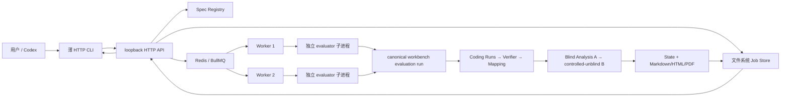

# 第二项目后端开发增量事实总报告与技术交接

> 日期：2026-09-25
> 范围：Analysis Agent v2.1 便携发布基线之后，Skill Evaluation Job Service V1、Analysis 定向修复、Backend Completion Stage 1–4 与最终真实双 HTTP Job 验收
> 最终源码分支：`codex/skill-evaluation-job-service`
> 最终 tracked commit：`9ff269a4b4c6ba30cd5f7085d51c8adceac4c7f4`
> 最终 tracked tree：`a55e0830baaa96be857b35b18f64dfd2dd90ce64`
> 最终处置：`PASS_SKILL_EVALUATION_JOB_SERVICE_V1_BACKEND_COMPLETION`
> 完整双 HTTP 验收：`PASS_FULL_DUAL_HTTP_EVALUATION_ACCEPTANCE`

## 0. 阅读规则、事实等级与收口核验

本文使用以下事实标签：

- `Implemented`：最终源码中可以定位到实现。
- `Verified`：存在确定性测试、Faux/fake 执行或真实运行证据。
- `Designed Only`：只存在于方案或 SPEC，尚未实现。
- `Deferred / Not Implemented`：已明确暂缓或未实现。
- `Unconfirmed`：现有证据不足，不能作肯定归因。

同一结论可以同时标记，例如 `Implemented + Verified`。除特别说明外，源码路径均相对于仓库根目录。

### 0.1 Stage 4 gate

本报告开始前完成了只读核验，Stage 4 已完整收口，因此不存在“应先停止、等待补收口”的缺口：

| 核验项 | 事实 | 状态 |
|---|---|---|
| 最终 Git 身份 | commit `9ff269a4b4c6ba30cd5f7085d51c8adceac4c7f4`；tree `a55e0830baaa96be857b35b18f64dfd2dd90ce64` | `Verified` |
| 最终分支 | `codex/skill-evaluation-job-service`；未 merge、未 push | `Verified` |
| 最终交付凭据 | `.runs/evaluation-service-delivery/v1-final-20260925/delivery-evidence.json`，处置为 `PASS_SKILL_EVALUATION_JOB_SERVICE_V1_BACKEND_COMPLETION` | `Verified` |
| post-commit Spec | `.runs/evaluation-service-specs/small-real-v10-final-delivery-9ff269a/specs.json`；SHA-256 `25cfc499c6555370b1c7bbb9482d326ecda8171c4a650d611910fb2a8413c584` | `Verified` |
| Frozen Plan | 同目录 `frozen-plan.json`；SHA-256 `9a591142bbe8911d2a57c4b5477978b36757eb0d827e0d3a503f6254917e946a` | `Verified` |
| executor identity | Spec 绑定最终 commit/tree 和 21 个文件 SHA-256；不匹配数为 0 | `Verified` |
| post-commit preflight | `ready_at_execution_boundary`；`real_model_calls=0`；`credential_reads=0` | `Verified` |
| Stage 状态 | Stage 1、2、3、4 均 `PASSED` | `Verified` |

本报告本身是最终 commit 之后新增的未提交文档；它不会改变上述 commit/tree 所对应的源码字节，也不会改变已生成的 post-commit Spec 身份。若未来提交本报告，新的文档 commit/tree 当然会不同，但不能反向把修改后的执行源码套用到旧 Spec。

## 1. 版本范围与技术演进

### 1.1 后端补充前，项目已经具备什么

`Implemented + Verified`：后端服务化以前，Analysis Agent v2.1 已经是一个可运行、artifact-first 的 Coding Agent Skill 评测工作台，而不是一个只有概念的 Agent Demo。主要已有能力是：

- public Direct Pi `AgentHarness`，固定 Pi commit `027a5847901b5dde30270abaa1041046cd2b4b55`，Pi Core 零 patch；
- 一个隔离 Coding Task 的 Workspace、工具调用、Session/Trace/Diff、External Verifier 与 Run Manifest；
- 按调用者给定顺序收集 Experience；从显式选择的证据有效 Runs 构建 Candidate Skill；
- Frozen Evaluation Plan、逐 Run binding、Formal Evaluation、Thin Mapping；
- Blind Analysis、sealed Finding、controlled-unblind、`analysis-state.json`、Markdown/HTML/PDF 报告与 `human_review_ready` 人工审阅边界；
- canonical CLI：`workbench task run`、`experience run`、`skill build`、`evaluation run`、`evaluation review`；
- Agent-facing `skills/workbench-orchestration/SKILL.md`，负责把用户意图路由到 canonical CLI，并坚持“CLI 是执行权威、Artifact 是结果权威”。

原 v2.1 冻结 18-Run fixture 的结果是 17 `PASS`、1 `TASK_FAILURE`、0 `INFRA_FAILURE`、0 `INVALID_TRIAL`；两条 Finding 均未证明 Skill 收益或因果。因此原项目的强项是可审计执行与保守证据治理，不是未经验证的自动自进化。证据入口：`docs/releases/ANALYSIS_AGENT_V2_1.md`、根 `README.md`、`workbench/scripts/workbench.mjs`、`skills/workbench-orchestration/SKILL.md`。

特别边界：Coding Agent、Pi、Verifier、Mapping、Analysis A/B、正式 Evaluation CLI、报告生成和原 Agent-facing Skill 都是本轮之前的能力，不能包装成本轮新增的“后端服务功能”。

### 1.2 为什么补 Job Service

原 CLI 能完整执行 Evaluation，但它是调用者同步管理的长任务：缺少 HTTP 异步提交、排队、多个 Worker 的受控并发、Job 级状态查询、服务端进程生命周期、失败后可查询的统一结果和 Artifact 面。后端补充的目标不是重做 Agent/Eval，而是把已有的长任务变成可提交、可排队、有限并发、可查询、可审计的后端 Job。

采用 Redis + BullMQ 的原因是复用成熟的 waiting/active、Worker claim、lock、stalled detection 和全局并发能力；采用文件系统 Job Store 的原因是原 Workbench 的权威证据本来就是文件 Artifact。两者职责互补：Redis 管调度，文件系统管不可变执行事实；没有为展示技术栈额外引入数据库、微服务或新 Eval 平台。

### 1.3 三层版本身份必须分开

| 角色 | commit / tree | 含义 |
|---|---|---|
| 原 Analysis Agent v2.1 产品提交 | `09681da3e80728f91adfd54c8bc5c2c2abf75345` / `11343aa5172aab4be6bda96b43d0118a02ab6c47` | canonical CLI 与 Agent-facing Skill 完成的产品身份；不是服务最终身份 |
| 便携发布/服务控制基线 | `603207f20436b1c31f67c3234936a9636f1d5c13` / `edc44fc90b52f7ea2ff4ef20b384e0bd8404f7a3` | 服务 worktree 的开发起点；主要是 v2.1 便携发布准备，不等于新服务能力 |
| 服务最终交付 | `9ff269a4b4c6ba30cd5f7085d51c8adceac4c7f4` / `a55e0830baaa96be857b35b18f64dfd2dd90ce64` | Stage 1–4 通过后的 tracked 最终源码与文档身份 |

`Unconfirmed`：最早一批服务实现和前三项 Analysis 修复先存在于未提交工作树，后来由 `a75d7aef777c932d8380120c8ff2da3831d15780` 一次性建立本地基线；这些子步骤没有各自独立 Git commit，不能虚构更细的 commit 归属。可以确认的提交演进如下：

| commit | 主要事实 |
|---|---|
| `a75d7aef777c932d8380120c8ff2da3831d15780` | 首个可回退的 Job Service V1 本地快照；包含服务主体、测试、已有 Analysis 定向修复与历史报告 |
| `75b41881d6266ea77a3e7b0ef4f27da9433f55a4` | 有界、内容无关的 Analysis Provider 生命周期诊断 |
| `b05105b09480b97995f4372d25961a138d8ebf6e` | 记录诊断版双 Job 复测现场 |
| `1662c6a5a761ac68189076bc895e95bb5d050f21` | controlled-unblind B 增加 Provider JSON Mode |
| `943061502ce77bf252dd05b05f1ba84fb787a5ba` | 薄 HTTP CLI、可靠性缺口回归与交付文档 |
| `b72df11ae0f1d1cdafd8be0486cd7618f62960a5` / tree `81a82b9ef04b5f6c4b237c9c97aaccb2f8ee8303` | 2026-09-25 最终双 HTTP Job 的实际执行源码身份 |
| `77b081d971b05aa468eeb5a190b28551315e159c` | 将完整双 HTTP 验收事实写入 tracked 记录 |
| `9ff269a4b4c6ba30cd5f7085d51c8adceac4c7f4` | Stage 4 最终 tracked 收口；之后重建 post-commit Spec 并零调用 preflight |

从 `603207f20436b1c31f67c3234936a9636f1d5c13` 到 `9ff269a4b4c6ba30cd5f7085d51c8adceac4c7f4` 的 tracked delta 为 58 个文件、约 7,347 行新增与 117 行删除。它同时包含新服务、Analysis 定向修复、测试、fixture 和交付报告；不能把这个总数等同于纯业务服务代码量。

## 2. 当前最终架构与完整执行链



### 2.1 分层职责

| 层 | 主要职责、输入与输出 | 技术与关键入口 | 属性 |
|---|---|---|---|
| 用户/Codex | 选择已注册 Spec、提供稳定幂等键、保存 Job ID、查询状态/结果/Artifact | 人工调用或脚本调用 | 原调用主体 |
| 薄 HTTP CLI | 调用同一 HTTP API；`specs/submit/status/wait/result/artifact`；输出机器可读 JSON；不执行 Evaluation | `workbench/scripts/evaluation-service-client.ts`：`parseClientArguments()`、`runEvaluationServiceClient()` | `Implemented + Verified`，本轮新增 |
| HTTP API | loopback 接入、16 KiB 请求上限、精确 Schema、Spec allowlist、提交/状态/结果/Artifact 路由 | Node `node:http`；`workbench/src/evaluation-service/api.ts`：`startEvaluationApi()` | `Implemented + Verified`，本轮新增 |
| Spec Registry | 严格解析 fake/faux/formal Spec；限制项目内路径；校验 Plan/config/executor digest、Git HEAD/tree；Credential profile 单独加载 | `registry.ts`：`loadEvaluationSpecRegistry()`、`validateFormalSpecFiles()`、`loadCredentialProfiles()` | `Implemented + Verified`，本轮新增 |
| Job Store | 原子写入/校验 request、Spec snapshot、queue receipt、launch/terminal；幂等索引；Artifact containment、普通文件、bytes/SHA | `job-store.ts`：`EvaluationJobStore` | `Implemented + Verified`，本轮新增 |
| Redis/BullMQ | waiting/active、Worker claim、locks、stalled detection、queue-wide concurrency、背压 | BullMQ `5.81.5`、ioredis `5.11.1`；`redis.ts` | `Implemented + Verified`，本轮新增 |
| Worker | 校验队列 envelope 与不可变文件；Worker 私有 Credential resolution；Attempt/Launch 对账；超时/清理；正式结果校验并写 terminal | `worker.ts`：`startEvaluationWorker()`、`processJob()`、`executeNewLaunch()` | `Implemented + Verified`，本轮新增 |
| evaluator 子进程 | 独立进程、独立 launch/output；流式有界日志；调用 canonical Evaluation CLI；写 child terminal | `evaluation-job-child.ts`：`runEvaluationJobChild()`、`runFormal()` | `Implemented + Verified`，本轮新增适配层 |
| Formal Evaluation CLI | 顺序执行 Frozen Plan 中的 Planned Runs，生成 Mapping 后进入 Review | `workbench/scripts/evaluate-evaluation.ts`：`evaluateEvaluation()`；`workbench evaluation run` | 原有能力，本轮复用；只增加 timeout 传递 |
| Coding Agent / Verifier | 每条 Run 独立 Workspace、Pi Agent、工具、外部 Verifier、Manifest | `workbench/src/coding-task/runner.ts`、`workbench/src/runtime/pi-runtime.ts` | 原有能力，本轮复用 |
| Mapping / Analysis A/B | Thin Mapping；盲态证据调查与 `update_state`；sealed Finding 后受控揭盲 | `trace-analysis/evaluation.ts`、`model-runner.ts`、`model-tools.ts`、`controlled-unblind.ts` | 原有能力 + 本轮定向修复 |
| Report | 从正式 State 和 Artifact 构建 Markdown/HTML/PDF | `analysis-report-view.ts`、`analysis-report-render.ts`、`analysis-report-generate.ts` | 原有能力，本轮复用 |
| HTTP Artifact | terminal 后发布 content-addressed 引用；每次下载重新校验文件身份、size、SHA，返回 `x-content-sha256` | `api.ts`、`result-validation.ts`、`job-store.ts` | `Implemented + Verified`，本轮新增 |

### 2.2 Workbench CLI、HTTP CLI 与 Agent-facing Skill 的关系

- canonical Workbench CLI 是评测执行权威；HTTP Worker 最终仍调用 `workbench evaluation run`。它没有被 HTTP CLI 替代。
- 新 HTTP CLI 只是服务客户端，不读 Credential、不排队、不直接运行 Agent、不复制 Evaluation 逻辑，也没有 cancel 接口。
- Agent-facing `skills/workbench-orchestration/SKILL.md` 在本轮没有改造成 HTTP Skill；其真实职责仍是把 Codex 路由到五个 canonical Workbench 命令并解释权威 Artifact。`Deferred / Not Implemented`：没有新增专门的 Evaluation Service Codex Skill。

Worker 复用 canonical CLI 的核心收益是同一套 Frozen Plan、`runCodingTask()`、Verifier、Mapping、Analysis、State 和 Report 合同只保留一个实现。服务层只负责提交、调度、隔离和结果发布；因此不会出现“CLI 通过、服务的另一套 Eval 状态机却产生不同语义”的双实现漂移。

### 2.3 三类持久状态的实际分工

1. Redis/BullMQ：调度态。保存 waiting/active/completed/failed、Worker locks 与 stalled/redelivery 协调；不是 Evaluation 成功的最终权威。
2. 文件系统 Job Store：服务控制态。每个 Job 有不可变 request、Spec snapshot、queue receipt、Attempt、Launch、process tree、child terminal、public terminal 和 Artifact refs。即使 Redis 临时不可用，已经完成的 Job 仍可从这里查询。
3. Formal Evaluation Artifact：业务证据。Run Manifest、Verifier、Thin Mapping、Analysis State、Session/Trace 和报告仍遵守原合同。只有 `result-validation.ts` 验证这些产物后，服务才写 `reason=completed`。

因此 BullMQ ACK 不等于评测成功；合法 `TASK_FAILURE` 也不等于服务故障。服务完成表示完整评测合同已形成并通过结构/身份验证，具体 Coding Task Outcome 继续由 Run Artifact 表达。

### 2.4 两种“并发”不能混淆

- Job 级并发：多个 Worker 可以同时管理不同 Evaluation。默认起点是一 Worker `concurrency=1`、queue global concurrency `2`；这两个数是环境参数，不是永久产品上限。
- 单个 Evaluation 内部：Frozen Plan 的 Planned Runs 仍按原正式顺序执行，没有为了展示并发改变评测语义。
- HTTP 请求并发、活跃 Evaluation 数、单个 Agent 的 Provider request 数和 Provider rate limit 是四类不同容量。

当前边界是单机 Windows、API 仅 `127.0.0.1`、Redis 私有部署、短 Job root。真实证据仅覆盖并发 2 与已验证的直连 Provider 网络路径。

## 3. 后端新增能力与关键工程设计

### 3.1 HTTP API 与注册 Spec

`Implemented + Verified`：`api.ts` 提供：

- `GET /health`
- `GET /v1/evaluation-specs`
- `POST /v1/evaluation-jobs`
- `GET /v1/evaluation-jobs/:jobId`
- `GET /v1/evaluation-jobs/:jobId/result`
- `GET /v1/evaluation-jobs/:jobId/artifacts/:name`

提交只接受精确三字段 `{kind, evaluation_spec_id, idempotency_key}`，且 V1 唯一业务 kind 为 `formal_skill_evaluation`。客户端不能提交任意本机路径、命令、环境变量或 Credential。`registry.ts` 对 formal Spec 校验 Git HEAD/tree、Plan SHA、config SHA 和 executor file SHA；`analysis_request_timeout_ms` 必须小于外层 Job timeout。

Checked-in `workbench/config/evaluation-service/specs.json` 只包含确定性 fake Specs，不能直接当成真实 Coding Agent 配置。真实小型 Spec 由 `prepare-evaluation-service-small-spec.ts` 在 ignored `.runs/` 下按当前 commit/tree 生成，Spec ID 为 `small-real-two-run-v2`。这样既能注册多个合法小型测试负载，又不开放任意上传/命令接口。

### 3.2 异步 Job、排队与查询

`Implemented + Verified`：HTTP POST 在接受不可变 Job artifacts 并提交 BullMQ 后立即返回 202，不等待数分钟的 Evaluation。状态查询把 filesystem terminal 与 BullMQ state 合并；如果 BullMQ 显示 completed 但没有权威 terminal，会返回 `inconsistent_requires_review`，不会虚报成功。

如果 Redis 在 request 已落盘后不可用，POST 返回 503 并提示调用方使用同一个幂等键安全重试；不把“API 没拿到队列 ACK”错误解释为“一定什么都没发生”。

### 3.3 并发、背压与容量

`Implemented + Verified`：

- `EVALUATION_SERVICE_WORKER_CONCURRENCY` 控制一个 Worker 内并发；初始默认 1。
- `EVALUATION_SERVICE_GLOBAL_CONCURRENCY` 通过 BullMQ `setGlobalConcurrency()` 控制全队列活跃 Job；初始默认 2。
- 可启动多个独立 Worker；容量不足时 Job 保留在队列，而不是无限启动 Agent。
- `config.ts` 还集中管理 Redis URL/queue、jobs root、lock duration、stalled interval、kill/reconciliation grace。

fake 容量测试验证了配置 1/2/4/8 都实际生效；100 个轻量 fake Job 在 concurrency 8 下 100/100 完成。它只证明调度机制，不证明真实 Coding Agent 在并发 4/8 下的容量。

### 3.4 Job、Workspace 与子进程隔离

`Implemented + Verified`：每个 Job ID 对应独立 Job root，内部固定 Attempt 1、独立 Launch token、独立 evaluator 子进程和独立 Evaluation output。Formal Evaluation 再为每个 Coding Run 建独立 Workspace。最终双 Job 的 evaluator、两对 Coding Run 和 Blind Analysis 都出现真实时间重叠，同时 Mapping 和 State 只引用各自 Job 的 Run ID。

Windows 上深层路径可能超过子进程有效工作目录限制，因此 README 明确要求短绝对 `EVALUATION_SERVICE_JOBS_ROOT`。这是当前部署要求，不是并发上限。

### 3.5 幂等、冲突与重复执行保护

`Implemented + Verified`：`EvaluationJobStore.createSubmission()` 对幂等键只持久化 SHA-256，并由键摘要确定 Job ID。相同键、相同 payload 返回原 Job（HTTP 200、`deduplicated=true`）；相同键、不同 payload 返回 409。队列 Job ID 也使用同一 Job ID，且默认 attempts 为 1。

这不是 exactly-once。BullMQ 仍可能 stalled/redeliver，因此 Worker 在重新取得 Job 时先检查 terminal、launch reservation、dispatch 与 process-tree evidence：

- 未越过 dispatch 边界且确认没有执行副作用时，才允许建立新 launch；
- 一旦已经 dispatch，或不能确认旧进程已清理，不会无条件 spawn；写成 `uncertain_requires_review` 并保留证据；
- 已有 terminal 直接复用，不重复执行。

`evaluation-service-crash.test.ts` 已验证 Worker crash 后 stalled redelivery 不会盲目重启已 dispatch 的 evaluator。

### 3.6 timeout 与进程树清理

`Implemented + Verified（当前 Windows）`：外层 Job timeout 由 Worker 管理，超时后调用 `process-supervisor.ts::terminateRecordedProcessTree()`。Supervisor 先核验 PID 命令行身份/launch token，再在 Windows 使用 `taskkill /T /F` 清理子树；只有确认无存活进程才写 `timed_out_cleanup_complete`，否则写 `uncertain_requires_review`，不虚报 cleanup complete。

确定性测试覆盖正常退出、timeout 和 nested child 清理。`Deferred / Not Implemented`：这不是任意平台、任意进程树、跨主机的通用 ProcessSupervisor；真实验收只覆盖当前 Windows 主机。

Analysis Provider request timeout 与 Job timeout 是不同层次。最终 Spec 分别为 300,000 ms 和 2,400,000 ms。当前 OpenAI SDK 的该 request timeout 覆盖 `fetch()` 到收到响应头，不是完整 SSE body 的 wall-time deadline；不能用“流总时长小于 300 秒”简单证明长流不会中断。

### 3.7 Credential、日志与安全边界

`Implemented + Verified`：Credential profile registry 与公开 Spec registry 分离，只有 Worker 进程配置 Credential registry。Redis Job Data、HTTP 响应和公开 Artifact 只包含 profile ID，不包含 secret 或任意 Credential path。child 读取 Credential 文件时检查普通文件、realpath/fstat 一致性，只解析一个预期键；随后删除继承环境中的 secret 通道，避免文件+环境双通道。

`bounded-log.ts::createBoundedLogSink()` 使用流式写入和固定展示上限，不采用会因 `maxBuffer` 溢出杀死 evaluator 的整块捕获；它记录 total/stored/truncated，并能跨 chunk 边界替换已知 secret。原始 Pi Session/Trace 与公开日志投影分离。

最终真实双 Job 对 Job/control/Redis RDB 共 98/98 个文件做实际 Credential 值扫描，0 命中；Stage 4 候选 tracked 集合也为 0 命中。API 只监听 loopback；没有多租户认证，也没有公共网络暴露能力。

### 3.8 正式结果校验与 Artifact 发布

`Implemented + Verified`：`result-validation.ts::validateEvaluationResult()` 不相信 child exit code 或队列 ACK。Formal Job 必须存在并一致地满足：

- Evaluation 状态为 `human_review_ready`；
- Run Manifest 数量与 Frozen Plan 相符；
- Mapping 的 Run/plan identity 能回到本 Job manifests；
- `analysis-state.json` phase 合法；
- Markdown/HTML/PDF 均存在；
-实际 Analysis timeout 与注册 Spec 一致。

发布时记录相对 Job root 的 path、bytes 与 SHA-256。下载时再次拒绝 symlink/multi-link/逃逸路径，并重新计算 size/hash；文件落盘后被篡改会返回 409。HTTP CLI 还会在本地落盘前核对 result metadata、响应摘要头和 bytes，并拒绝覆盖已有输出。

### 3.9 薄 HTTP CLI

`Implemented + Verified`：`evaluation-service-client.ts` 提供六个命令；支持一次提交多个独立 idempotency key、一次查询多个 Job ID。多提交仍是依次调用已有 POST，不虚构 server-side atomic batch；后一个失败时保留前面已接受的 Job ID。

退出码：

| code | 语义 |
|---:|---|
| 0 | 客户端操作成功；包括 Job completed 但内部存在合法 `TASK_FAILURE` |
| 2 | 客户端参数/使用错误 |
| 3 | 仅本地 `wait` 超时 |
| 4 | HTTP/服务不可用或服务错误 |
| 5 | Job 基础设施终态失败或状态不一致 |
| 6 | Artifact 查询、完整性或 fresh-output 错误 |

`wait` 超时、终端退出或 Codex 停止等待都不向服务发送取消；后台 Job 继续按服务端生命周期运行，之后可凭 Job ID 查询。`Deferred / Not Implemented`：没有 cancel API 或通用取消系统。

### 3.10 Git、Spec 与可复现身份

`Implemented + Verified`：`prepare-evaluation-service-small-spec.ts` 从当前 Git HEAD/tree、Frozen Plan、两条 config、Candidate/Verifier 与 21 个 executor 文件生成只写新目录的 Formal Spec；`preflight-evaluation-service-spec.ts` 先完成完整身份/输入检查，再用替代 `runTask` 在真实执行边界前故意停止，保证零 Credential、零模型。

最终 21 个 executor SHA-256 如下；同一表也保存在 delivery evidence：

<details>
<summary>展开最终 executor identity</summary>

| 路径 | SHA-256 |
|---|---|
| `workbench/package.json` | `267966f33f884cb7554dc97598de235d2e4c484d426f21c7e1baa5a3572b5a13` |
| `workbench/package-lock.json` | `bafa8405cdc5e827f03e2c03cc98939bab92ec1065904db04ff7de509565d4b5` |
| `workbench/scripts/evaluate-evaluation.ts` | `30ccd3e058b9c9e6b7e58f66cf6ebb74b79649d2d2a99ed2840cde7cdd70d588` |
| `workbench/scripts/review-evaluation.ts` | `fe4ea963bbd61aa67ba9a7adc4c44a459411d06b0011391d1a14bd611ca51320` |
| `workbench/src/coding-task/runner.ts` | `83a4f7f52931a2fa3e8ba520b5ce41995cd3c072b5738822685182fd46bb3a21` |
| `workbench/src/runtime/pi-runtime.ts` | `88fad88beb06d656977d4766a454b132cfc95e82d9424330a3ef61cb22dd81f4` |
| `workbench/src/trace-analysis/evaluation.ts` | `771b7fb1d92b0a7cc5f95b4742b60145802577a848dbeddd40a9146c4af28e6c` |
| `workbench/src/trace-analysis/model-runner.ts` | `14baf1e883fae489fd147cdd89ba832c2ad8550d604161bdccf64fb0a6804416` |
| `workbench/src/trace-analysis/model-tools.ts` | `14b47924edccdacedce78fcad0125ee4d7ee8f6e18602463d1f7eb64da1f587a` |
| `workbench/src/trace-analysis/runtime-config.ts` | `d61ff6448d850bb90be55465255a36bbbc32f7ed8738141b0108d5ed4e3ba09d` |
| `workbench/src/evaluation-service/api.ts` | `3fa8d9c1ea39e04b3bb5e8215a129a60780af5d01e2c7e04f11d3bab937b3c97` |
| `workbench/src/evaluation-service/bounded-log.ts` | `d41b878cae42cb5bf7131d1e7456f1c55c149f59f05d3bacbddcfde990321251` |
| `workbench/src/evaluation-service/config.ts` | `8235502fe37d9655f1fac762a01e9ed0eaaa3f91e505dcc04d7bd4924e242ebd` |
| `workbench/src/evaluation-service/contracts.ts` | `eadc2100afeab28877dc616743e0fada03fb1f96bf73e078a052c85e0a6cac8e` |
| `workbench/src/evaluation-service/evaluation-job-child.ts` | `41cdba0b458be7d6931b4a2e4ba8352fe57d460858b1d9c2f086ce1e193b47b8` |
| `workbench/src/evaluation-service/job-store.ts` | `a1da81345cbf3f31c2ec32e1a31baba268da9d3c0d761b0d9b2742d32daab2e3` |
| `workbench/src/evaluation-service/process-supervisor.ts` | `c3d6a64b00998e328433eb26531f870e18be7b9ed9a25492f18aa82df656106e` |
| `workbench/src/evaluation-service/redis.ts` | `745a20a3e4fb91ec354f9344d870a3a9993b440605b060e90ea549c649cdc9bb` |
| `workbench/src/evaluation-service/registry.ts` | `34c33ede1da5101d4090553494abbf4d65a78b5d26c696df7e50085295e839e1` |
| `workbench/src/evaluation-service/result-validation.ts` | `60e4c6f8a41d651108a7e29cdb5ca222277500583c0e89cc81a4d88f723668a1` |
| `workbench/src/evaluation-service/worker.ts` | `992e5488278137138d112104111fe3e2640ac99504eb20631ca8a33f82cd465d` |

</details>

## 4. Analysis 相关定向修复

这一节描述的是原 Analysis 体系上的局部修复，不是新的后端架构。

### 4.1 原有 A/B 合同

- A（Blind Analysis）看不到 Candidate Skill 内容和真实 condition 名；通过 `list_runs`、`process_view`、`search_trace`、`read_evidence`、`update_state` 五个工具调查 Run 过程，只有 `update_state` 能正式持久化 State。
- A 完成后 Finding 被 sealed；B（controlled-unblind）只接收 finding-scoped safe evidence、condition 还原和冻结 Candidate，用零工具的一次结构化响应填写 `alignments` 与 `follow_up_observations`。
- B 不是自由改写 A 的阶段；严格 parser 验证根键、Finding 覆盖、Skill SHA 和枚举后才进入 `human_review_ready`。
- 原有合同已经规定：如果 A 没有 kept Finding，`completeZeroFindingControlledUnblindState()` 确定性生成空 B 结果，不读取 Candidate/Credential，不调用 Provider。最终双 Job 的 Job B 正好真实走过这一零调用路径。

### 4.2 Provider 错误优先级

`Implemented + Verified`：初次真实 Analysis 中，Provider `terminated` 后又因 State 不存在抛错，外层错误遮蔽了根因。`model-runner.ts::assertBlindAnalysisTerminal()` 现在区分并按正确优先级处理：Provider/runtime error、aborted、正常结束但没有调用 `update_state`、State validation failure、State persistence failure。

这没有降低 State 验收标准：错误响应中出现部分 `update_state` toolCall 片段，不等于 Harness 执行了工具，更不等于 State 持久化。Pi agent loop 在 `stopReason=error` 时先返回；没有 tool result、没有正式 State 的调用片段会被拒绝。测试入口：`trace-analysis-model.test.ts` 的 Provider error priority、invalid update/state lifecycle 用例。

### 4.3 Trace Locator 合同

`Implemented + Verified`：`read_evidence(artifact=trace)` 的 Schema 现在强制显式提供正整数 `sequence`，非 trace Artifact 反而禁止 sequence；工具描述明确 `process_view` 的 operation count 不能推导 Trace sequence。该修复消除了“运行时要求存在、Schema 却没告诉模型”的合同不一致，没有扩展新的检索体系。源码：`model-tools.ts::createAnalysisTools()`；测试：`trace-analysis-model.test.ts`。

### 4.4 request timeout 可配置与可审计

`Implemented + Verified`：`runtime-config.ts::resolveAnalysisRequestTimeoutMs()` 提供集中默认值和校验；`evaluate-evaluation.ts`、`review-evaluation.ts`、Service Spec 与 child 调用链把值实际传到 Pi/OpenAI SDK。最终小型 Spec 使用 300,000 ms，外层 Job 仍为 2,400,000 ms。没有降低模型、thinking、token、工具或任务预算。

### 4.5 安全、有界 Provider 生命周期诊断

`Implemented + Verified`：`model-runner.ts::AnalysisProviderDiagnosticsRecorder` 生成 `review/analysis-provider-requests.json`。它最多记录 64 个 invocation、每个 128 个 request，只包含：ordinal、dispatch/header/message-end 时间、允许列出的 status/request ID、stop reason、数字 usage、内容块数量/字节、Tool 名和 `update_state` emitted/started/completed/persisted/accepted 生命周期。

它明确不记录 Prompt、响应正文、thinking 正文、Tool arguments、Credential 或任意 headers。它可以区分“响应头前失败”“响应头后流错误”“aborted”“State 已输出但未执行”等假设；如果底层异常已在 pinned Pi 中被归一化为 `terminated`，它不能恢复丢失的 socket `cause/code`。本轮没有修改 pinned Pi，也没有 monkeypatch 全局 `fetch`。

### 4.6 B 的 JSON Mode

`Implemented + Verified`：commit `1662c6a5a761ac68189076bc895e95bb5d050f21` 只在 controlled-unblind 的 `completeSimple()` 请求 payload 上加入 `response_format: {type: "json_object"}`。模型、message、stream、token、thinking 与正式 parser 都不变；Blind Analysis A 不使用该模式。

目标是减少 B 正常响应的 JSON 外壳/尾部格式错误。它不是 Provider 传输错误的修复，也不保证 `alignments` 覆盖、Finding ID、Skill digest、枚举值等语义合同必然正确。Provider 调用失败或 JSON/语义解析失败时，原 `alignment_ready` State 保持不变；invocation evidence 在解析前保存。

单次真实 B Canary 恰好 1 次 HTTP 200 Provider request 后到达 `human_review_ready`，源 State SHA 前后不变，证明该最小修改在一个真实场景生效。`Deferred / Not Implemented`：B-only 自动重试、Partial Report、任意阶段 resume 和 B 独立恢复服务均未实现。

## 5. 真实故障、调查与最终解决情况

### 5.1 初次真实 Analysis：错误被 State 缺失遮蔽

**现象。** 短 Job root 的初次真实执行完成两个 Coding Run、Verifier 与 Thin Mapping；Blind Analysis 有 8 次带 usage 的正常响应，第 9 次 `stopReason=error / terminated`，没有调用有效 `update_state`，也没有正式 State/Report。

**证据与排查。** Job timeout 2,400 秒未命中；当时 request timeout 120 秒是怀疑对象，但历史证据不能严格区分本地 timeout 与上游断流。21 个工具调用中出现 trace sequence 合同问题；没有余额不足证据。报告：`SKILL_EVALUATION_JOB_SERVICE_V1_REAL_ANALYSIS_FAILURE_DIAGNOSIS_2026-09-23.md`。

**修复与复测。** 修复 Provider error priority、Trace Locator Schema、可配置 timeout；零模型回归和 `evaluation review --dry-run` 通过。之后 Analysis-only Review 成功，继而单个全新 HTTP Job 完整成功。

**可支持结论。** `Verified`：原错误传播确有缺陷且已修复；`Unconfirmed`：第一次 `terminated` 的唯一底层原因无法从旧日志恢复。

### 5.2 单 Job E2E 中的 B 精确键错误

**现象。** 第一个完整 HTTP Job 的 A 已形成 `alignment_ready`，B 返回内容不满足根级精确键合同，Job 保持 `execution_failed`。旧顺序先 parse 再落 invocation，导致无法回看原始正常响应的确切结构。

**改动。** controlled-unblind invocation 在 parse 前只写持久化，同一输出根存在 invocation 时拒绝重复调用；失败证据进入 HTTP Artifact。B Prompt/合同被澄清，但 parser 没有放宽。

**复测。** 独立 Analysis-only 成功；随后 Job `e45998aaeb9627a5db6ca9c4331785182926262e75987807cf9bd6c20a84e488` 在约 148 秒内完成 `HTTP → Queue → 2 Runs → Verifier → Mapping → A/B → State → 三报告`，14/14 HTTP Artifact bytes/SHA 匹配。

**结论。** `Implemented + Verified`：一条真实单 Job 服务 E2E 在 2026-09-23 已经成立；旧失败 Job 未被改写。

### 5.3 首次真实双 Job 的同时 `terminated`

**现象。** 两个 evaluator 实际重叠约 190 秒，四个 Run 和两个 Mapping 都有效，但两条 Blind Analysis 最终流在相差约 29 ms 的绝对时刻结束为 `terminated`，无 State/Report。

**关键证据。** 两条最终请求都已收到 HTTP response headers 和部分流内容；两个 evaluator 是不同进程，各自拥有 Harness、OpenAI client 和进程内连接池。排除了作为直接触发器的 2,400 秒 Job timeout、300 秒 fetch-to-headers timeout、Worker crash、stalled redelivery、Credential 错误与已记录 429。实际栈为 `https://api.deepseek.com`、API type `openai-completions`、配置模型 `deepseek/deepseek-v4-flash`、响应模型 `deepseek-flash`、pinned Pi `027a584...`、OpenAI SDK `6.26.0`；诊断环境的 Node 为 `v24.14.1`、vendored undici 为 `7.24.4`。错误进入 Workbench 前已被 pinned Pi Provider 压缩为 message；原始 `cause/code/request ID` 丢失。

**网络事实。** 当时无显式 HTTP(S) proxy env、WinHTTP direct、WinINET proxy disabled，但 Clash TUN 实际启用；Clash 日志记录到 `api.deepseek.com:443` 的两条 TUN/GLOBAL TCP 连接。日志没有 close/reset/request ID，不能据此证明 TUN 是唯一根因。

**改动。** 增加上述安全 Provider lifecycle diagnostics，而不是全局重试、降低预算或修改 pinned Pi。

**结论。** `Verified`：故障属于收到 headers 后的流式终止，并且不是服务 Job timeout/Worker crash 的已知表现。`Inference`：共同外部网络/代理/Provider 路径事件比两个独立进程同时命中各自本地 timer 更符合证据。`Unconfirmed`：DeepSeek、Clash/TUN、代理节点、本机网络、SDK/undici 中哪一层是唯一根因。

### 5.4 诊断版复测：传输正常但 B JSON 合同失败

**现象。** 新双 Job 复测中，Job B 完整 `human_review_ready`；Job A 的 A 已提交合法 State，B 的 HTTP 200/normal response 在 root 提前多一个 `}`，必需的 `follow_up_observations` 落在 root 外，被严格 parser 拒绝。

**证据。** 两个 evaluator、两对 Coding Run 和 Blind Analysis 均重叠；Job B 15/15 HTTP Artifact 通过；Job A 8/8 失败 Artifact 可查。两 Job 共 35 次 Provider request，记录费用 USD `0.019430096`。这与 `terminated` 是不同故障类别：前者是正常响应后的 JSON 合同错误，后者是流式传输未正常结束。

**处理。** 只对 B 加 JSON Mode，不修改 A，不放宽 State/Finding 合同。

### 5.5 JSON Mode Canary 与再次双 Job failure

**Canary。** 复用已有合法 `alignment_ready` State，在新输出根只运行 B；1 次 HTTP 200，得到精确根键、1 alignment、1 follow-up，最终 `human_review_ready`，源 State hash 不变。`Verified`：JSON Mode 的目标路径可工作。

**完整双 Job。** 随后唯一一组两个全新 HTTP Job 都在 Blind A 最后请求收到 HTTP 200 headers 后以 `stream_error_after_headers / terminated` 结束，根本没有进入 B。`Verified`：这次失败不能归咎于 B JSON Mode，也不能用 JSON Mode修复传输问题。

### 5.6 TUIC 与直连 Analysis-only 对照

**TUIC/TUN。** 两条并发 Review 复用既有四个 valid Runs/两份 Mapping；Clash GLOBAL 的叶子为 TUIC，TUN 路径有两条 DeepSeek 连接。一条 Review 完整成功，另一条第 9 次 Blind 请求在 HTTP 200 headers 和大量流式内容后约 178.609 秒 `terminated`。因此 TUIC 没有消除单长流故障，也没有复现“两条同一时刻同时断”。

**直连。** TUN disabled、无 Meta 默认路由、无 proxy env；无 Credential HEAD 返回 401 且 Clash 日志无 DeepSeek 流量，支持请求绕过 Clash。两条并发 Analysis-only 都 `human_review_ready`：各 7 次 Blind + 1 次 B JSON request，最长请求 49.472/31.202 秒，总费用 USD `0.0182699608`。

**边界。** `Verified`：直连路径下两个并发 Analysis 可以同时成功；`Inference`：Clash/TUN/代理路径是此前终止的可信贡献因素。`Unconfirmed`：直连成功不能证明代理是所有历史终止的唯一原因，因为样本小、模型响应长度与运行时网络状态均不同。

### 5.7 最终完整双 HTTP Job

在 commit `b72df11ae0f1d1cdafd8be0486cd7618f62960a5` / tree `81a82b9ef04b5f6c4b237c9c97aaccb2f8ee8303`、同一新 Spec identity、两个 Worker local concurrency 1、queue global concurrency 2、已核验直连路径下，提交两个全新、不同幂等键的 HTTP Job。两者均完成 `completed / human_review_ready`；没有第三个 Job、重试、B 降级、预算降低或跨 Job 拼接。

因此 Stage 1 的最终状态从历史 `BLOCKED` 更新为 `PASSED`，但历史失败现场继续保留。成功是新的完整执行证据，不是把失败 Job 改写成成功。

## 6. 最终验证与量化证据

### 6.1 验证矩阵

| 层级/场景 | 执行类型 | 结果与样本 | 状态 / 证据 |
|---|---|---|---|
| 核心 HTTP/Store/Queue | 确定性 + 本地 Redis | 提交、查询、业务 failure、execution failure、timeout、Artifact | `Implemented + Verified`；`evaluation-service-core.test.ts`、`evaluation-service-redis.test.ts` |
| Worker crash/stalled | fake + real Redis | dispatch 后 Worker 死亡，redelivery 不盲目再 spawn | `Verified`；`evaluation-service-crash.test.ts` |
| Credential 隔离 | 确定性 | Job Data/HTTP/Artifact 无 secret | `Verified`；`evaluation-service-credential.test.ts` |
| Faux Formal | Faux/Pi，零真实 Provider | 固定两 Run，贯穿 Pi/tools/Verifier/Mapping/Analysis/report | `Verified`；`evaluation-service-faux-formal.test.ts` |
| fake 并发 | fake，零 Provider | concurrency 1/2/4/8 均观察到对应调度行为 | `Verified`；不能外推真实 Agent 容量 |
| fake 批量 | fake，零 Provider | 100/100 完成；concurrency 8 约 23.74 jobs/s | `Verified`；仅服务机制吞吐 |
| 单 Job 真实 E2E | 真实 DeepSeek | 2 Runs、A/B、三报告、14/14 Artifact | `Verified`；`REAL_E2E_VALIDATION_2026-09-23.md` |
| 初次真实双 Job | 真实 DeepSeek | evaluator/Run/Analysis 有重叠，四 Run 通过；双 A `terminated` | `Verified failure evidence`；不是完整 E2E pass |
| 诊断版双 Job | 真实 DeepSeek | 一成一败；失败为正常响应后的 B JSON root 错误 | `Verified failure evidence` |
| B JSON Canary | 真实 DeepSeek | 1 次 B request；`human_review_ready` | `Verified`；不能替代 HTTP E2E |
| TUIC 双 Analysis-only | 真实 DeepSeek | 一成一败；失败为长流 headers 后 `terminated` | `Verified diagnostic evidence` |
| 直连双 Analysis-only | 真实 DeepSeek | 两条均 `human_review_ready` | `Verified`；不替代双 HTTP Job |
| 最终真实双 HTTP Job | 真实 DeepSeek | 两条均完整到正式 State/报告，29/29 Artifact | `Verified`；`PASS_FULL_DUAL_HTTP_EVALUATION_ACCEPTANCE` |
| HTTP CLI | 确定性 + real loopback fake Job | 5/5 client tests；submit→wait→result→artifact | `Verified`；`evaluation-service-client.test.ts` |
| Stage 3 服务回归 | 零模型 | `npm run evaluation-service:test` 18/18 | `Verified` |
| TypeScript | 静态 | `npm run typecheck` PASS | `Verified` |
| Git/Spec/preflight | 静态 + 零调用 | final commit/tree、21 digest、preflight ready、0 model/0 Credential | `Verified`；delivery evidence |

Stage 3 的 18/18 覆盖 client、core、crash/stalled、Credential、Faux、Redis/idempotency、timeout/nested cleanup、Redis-degraded completed reads、Artifact tamper、双 fake Job 隔离与真实 loopback client。未受影响的昂贵真实实验没有机械重跑。

### 6.2 最终双 HTTP Job 明细

| 项 | Job A | Job B |
|---|---|---|
| Job ID | `8fd08a5e1c79f16f36275125a6bc49c9194f422049d9fce7c50774d4135b4479` | `06651f5449ae31d75e9df105e8149ba4361af0f5311ac3bdcfd002c717d81d12` |
| 终态 | `completed / human_review_ready` | `completed / human_review_ready` |
| 模型 / Analysis timeout | `deepseek/deepseek-v4-flash` / 300,000 ms | 同左 |
| evaluator 时间 | `19:25:44.515Z → 19:28:29.317Z` | `19:25:44.631Z → 19:30:55.925Z` |
| cleanup | `cleanup_confirmed=true` | `cleanup_confirmed=true` |
| Coding | 2 Runs；均 completed/passed；每 Run 5 requests、6 tools | 同左 |
| Blind A | 9 normal requests；1 kept Finding | 10 normal requests；0 kept Finding |
| B | JSON Mode 1 normal request；1 alignment + 1 follow-up | 零 Provider request；确定性空结果 |
| 报告 bytes（MD/HTML/PDF） | `10289 / 14389 / 130504` | `3606 / 6077 / 80227` |
| HTTP Artifact | 15/15 | 14/14 |
| Provider requests | Coding 10 + Analysis 10 = 20 | Coding 10 + Analysis 10 = 20 |
| 记录费用 | USD `0.0126376600` | USD `0.0190392496` |

时间重叠：

- evaluator 重叠 `164686 ms`；
- 第一对 Coding Run 重叠 `5770 ms`，第二对 `3492 ms`；
- Blind Analysis 重叠 `129654 ms`。

Usage 汇总（从四个 Run Manifest 与两个 `analysis-provider-requests.json` 只读求和）：

| 项 | Job A | Job B | 合计 |
|---|---:|---:|---:|
| Provider requests | 20 | 20 | 40 |
| input tokens | 29,569 | 15,236 | 44,805 |
| output tokens | 29,134 | 58,979 | 88,113 |
| Analysis cache-read tokens | 112,896 | 130,944 | 243,840 |
| Analysis reasoning tokens | 24,071 | 52,887 | 76,958 |
| cost USD | 0.0126376600 | 0.0190392496 | 0.0316769096 |

这里没有伪造“统一 total token”：Coding Manifest 记录 request/input/output/cost/tool，Analysis diagnostics 还单独记录 cache-read/reasoning；上表按字段如实展示，避免重复加总口径不一致。

两份 Mapping 各自只引用本 Job 的两条 Run；两份 State 的 `covered_runs` 与各自 Mapping 精确一致。Job A 走了真实 B；Job B 因无 kept Finding 正确跳过 B 模型调用。两份 PDF magic 均为 `%PDF`，29/29 HTTP 读取的 status、bytes、SHA-256 与 `x-content-sha256` 一致。98/98 文件 Credential 精确值扫描 0 命中；runner/evaluator PID 全部退出，API/Worker/Redis 均停止，测试端口不再监听。

证据根：`D:\AI\ejc2-20260925-final-01\jobs\<job-id>`；控制/Redis 快照根：`D:\AI\ejc2-control-20260925-final-01`。这些是本机 ignored 运行证据，不属于 tracked Git 交付。

## 7. 当前实际使用方式

以下是“操作结构”，尖括号内容必须替换为本机真实值，不是可直接复制的 Credential/个人路径。

### 7.1 直接运行原 Workbench CLI

```powershell
Set-Location <project-root>\workbench
npm run workbench -- evaluation run --help
npm run workbench -- evaluation review --help
```

实际 Formal Evaluation 必须按 `--help` 提供 Frozen Plan、逐 plan-id binding、private Credential file 和 fresh output。它是最直接的原有执行入口，不经过 Redis/HTTP。

### 7.2 准备真实小型注册 Spec

在最终 commit 上选择一个全新的 ignored 输出目录：

```powershell
Set-Location <project-root>\workbench
$env:EVALUATION_SERVICE_SMALL_SPEC_OUTPUT = '<project-root>\.runs\evaluation-service-specs\<new-spec-dir>'
npm run evaluation-service:prepare-small-real
npm run evaluation-service:preflight-spec -- `
  "$env:EVALUATION_SERVICE_SMALL_SPEC_OUTPUT\specs.json" `
  small-real-two-run-v2 `
  '<project-root>\.runs\evaluation-service-preflight\<new-empty-output>'
```

preflight 应在 execution boundary 前停止并报告 0 model/0 Credential；如果 commit/tree 或任一 executor digest 不符，不得用旧 Spec 执行新源码。

### 7.3 启动 Redis、API 和 Worker

最低依赖是 Node.js `>=22.19.0`、已安装 Workbench dependencies、可达的私有 Redis。配置模板见 `workbench/config/evaluation-service/README.md`。核心参数：

```powershell
$env:EVALUATION_SERVICE_PROJECT_ROOT = '<project-root>'
$env:EVALUATION_SERVICE_SPEC_REGISTRY = '<generated-specs.json>'
$env:EVALUATION_SERVICE_JOBS_ROOT = '<short-absolute-job-root>'
$env:EVALUATION_SERVICE_REDIS_URL = 'redis://127.0.0.1:<port>/<db>'
$env:EVALUATION_SERVICE_QUEUE = '<queue-name>'
$env:EVALUATION_SERVICE_PORT = '<loopback-port>'
$env:EVALUATION_SERVICE_WORKER_CONCURRENCY = '1'
$env:EVALUATION_SERVICE_GLOBAL_CONCURRENCY = '2'
```

只在 Worker 进程设置：

```powershell
$env:EVALUATION_SERVICE_CREDENTIAL_REGISTRY = '<private-credential-registry.json>'
```

分别运行：

```powershell
npm run evaluation-service:api
npm run evaluation-service:worker
```

真实并发 2 的已验证部署是两个独立 Worker 进程，各自 concurrency 1，global concurrency 2。

### 7.4 用同一 HTTP CLI 提交和查询

```powershell
$base = 'http://127.0.0.1:<port>'
npm run evaluation-service:client -- specs --base-url $base
npm run evaluation-service:client -- submit --base-url $base `
  --spec small-real-two-run-v2 --idempotency-key '<stable-key-a>' `
  --idempotency-key '<stable-key-b>'
```

每个 key 必须不同才能形成两个独立 Job。保存输出中的 Job ID：

```powershell
npm run evaluation-service:client -- status --base-url $base --job '<job-id-a>' --job '<job-id-b>'
npm run evaluation-service:client -- wait --base-url $base --job '<job-id-a>' --job '<job-id-b>' `
  --timeout-ms 2700000 --poll-ms 1000
npm run evaluation-service:client -- result --base-url $base --job '<job-id-a>' --job '<job-id-b>'
npm run evaluation-service:client -- artifact --base-url $base --job '<job-id-a>' `
  --name report_markdown --output '<fresh-output-file>'
```

客户端等待超时不取消后台任务。失败时先查 status/result；再查 Job root 中的 `terminal.json`、Attempt/Launch 的 `child-terminal.json`、stdout/stderr/log metadata 和正式 Evaluation output。Analysis 故障优先查看 `review/analysis-provider-requests.json`、Session、State 是否存在、Mapping/Run refs。不要修改旧失败 Job 或把其他 Review 产物拼进去。

## 8. 面试与简历可展示事实

### A. 已经真实做过、可以据实讲述

1. `Implemented + Verified`：把原同步 Formal Evaluation CLI 封装成 loopback HTTP 异步 Job Service，完成提交、排队、Worker 执行、状态/结果/Artifact 查询。
2. `Implemented + Verified`：使用 Redis/BullMQ 管理 waiting/active、locks、stalled detection、局部/全局并发和背压；真实启动两个 Worker 完成并发 2。
3. `Implemented + Verified`：文件系统不可变 Job Store、幂等键冲突、Attempt/Launch/dispatch evidence、重复投递后不盲目执行副作用。
4. `Implemented + Verified`：独立 evaluator 子进程、独立 Job root/Workspace、有界流式日志、Windows 子进程树 timeout 清理和 cleanup 真实性。
5. `Implemented + Verified`：Worker-only Credential、公开结果脱敏、Artifact path/普通文件/size/SHA 双重校验；真实 98 文件 secret scan 0 命中。
6. `Implemented + Verified`：薄 HTTP CLI 的机器可读输出、分层退出码、非取消式 wait、完整性校验下载。
7. `Implemented + Verified`：Provider/runtime/State 错误分类、安全请求生命周期诊断、B JSON Mode 的窄修复和零 Finding 零调用路径。
8. `Verified`：一个真实单 Job E2E 和一组两个全新真实 HTTP Job 的完整并发 E2E；后者四 Run/Verifier、双 Mapping/State、三报告、29/29 HTTP Artifact 均通过。
9. `Implemented + Verified`：最终 Git/source identity、21 executor digest、可重建 Spec、零模型/零 Credential preflight 和 Stage 4 本地 commit 交付。

对应源码入口：`workbench/src/evaluation-service/`、`workbench/scripts/evaluation-service-client.ts`、`workbench/src/trace-analysis/model-runner.ts`；真实证据入口见本报告第 10 节。

### B. 具有工程判断价值的设计取舍

- 复用 canonical Evaluation CLI，而不是在 Worker 中复制 Agent Loop、Verifier、Mapping 和 Analysis 状态机。
- 让 BullMQ 管调度、文件系统管不可变执行事实、Formal Artifact 管业务结论；避免把 Redis ACK 当成 Evaluation 结果。
- 区分合法 `TASK_FAILURE`、Provider/传输故障、JSON/State 合同错误和服务基础设施故障。
- 明确 at-least-once delivery 不能变成 exactly-once 宣称；越过副作用边界后的未知状态进入 `uncertain_requires_review`。
- 不用测试的小 timeout、低 token、低日志额度替代产品配置；fake 控制成本，真实验收保持正式模型能力。
- 故障先保留现场、增强最小可观测性，再决定是否值得做恢复；没有因一次 B 错误就引入 Temporal、通用恢复平台或任意阶段 resume。
- 网络对照遵守 Fact/Inference/Unconfirmed：直连成功提高代理路径贡献的可信度，但不把相关性包装成唯一根因。
- 真实双 Job 同时成功后仍保持 `human_review_ready`，没有把评测系统扩张为自动修改 Skill 的闭环。

### C. 不能直接声称或必须限定

- `Deferred / Not Implemented`：生产级高可用、多租户认证、公共网络服务、跨机器调度、自动扩缩容、完整监控平台。
- `Deferred / Not Implemented`：exactly-once、任意崩溃自动恢复、跨重启精确恢复、自动付费重试、Job cancel。
- `Deferred / Not Implemented`：B-only 自动 retry/resume、Partial Report、任意阶段恢复、Temporal 类通用工作流引擎。
- `Unverified`：真实并发 4/8；已有 4/8 只是 fake 调度测试。
- `Unverified`：所有代理/TUN/网络路径的稳定性；真实完整双 Job 只证明已验证直连路径。
- `Unverified`：生产吞吐或容量；100 fake Jobs/s 不能外推 Coding Agent。
- `Unverified`：Skill 的一般收益、因果提升、跨 Benchmark/holdout 泛化；本轮把 Skill 作为业务负载，没有研究收益。
- `Not claimed`：SWE-bench、Formal18 重跑、Kubernetes、Spring Boot、新数据库或微服务架构。

### 值得整理成后续面试追问的 9 个问题

1. 为什么选择 BullMQ + filesystem，而不是“所有状态都放 Redis/数据库”？证据：`redis.ts`、`job-store.ts`、`api.ts`。
2. BullMQ 可能重复投递时，如何避免重复模型调用和文件副作用？证据：`worker.ts`、`evaluation-service-crash.test.ts`。
3. 为什么 queue completed 不等于业务 completed？证据：`result-validation.ts` 与 terminal 合同。
4. 如何区分合法 `TASK_FAILURE` 与基础设施失败？证据：HTTP CLI exit code、fake task-failure/real Formal result tests。
5. timeout 后如何证明进程树真的清理，而不是只发送 kill？证据：`process-supervisor.ts`、nested timeout test。
6. Credential 为什么不会进入 Redis、日志和 Artifact？证据：`registry.ts`、`evaluation-job-child.ts`、`bounded-log.ts`、Credential test/scan。
7. 为什么 B 使用 JSON Mode，而 A 不使用；JSON Mode 能保证什么、不能保证什么？证据：`model-runner.ts`、`trace-analysis-phase4b.test.ts`、Canary 报告。
8. 如何证明两个真实 Job 真正并发且彼此隔离，而不是只同时入队？证据：最终时间区间、Mapping/State refs、29/29 Artifact。
9. 为什么没有马上实现 B-only resume 或通用恢复？证据：故障分类、合法 State 边界与当前 Deferred 列表。

## 9. 当前限制、事实缺口与后续边界

- 最终服务源码与 Stage 1–4 没有剩余阻塞；本地分支尚未 merge/push，这是交付边界，不是功能故障。
- 真实 Formal Spec 与 Job Artifact 位于 ignored `.runs/` 或外部短 Job root；Git commit 不替代这些运行证据的保存。
- checked-in 默认 registry 是 fake 测试 registry；真实执行必须在当前 commit 上重新生成 formal registry，并提供 Worker 私有 Credential registry。
- 当前 completed Job 的 Redis-degraded read 已测试，但没有承诺 Redis 集群 HA、跨主机 failover 或任意重启恢复。
- Windows 短 Job root 是已知部署要求；POSIX cleanup 代码存在，但本轮真实验收不是跨平台认证。
- Provider lifecycle diagnostics 无法恢复 pinned Pi 已丢弃的底层 socket cause；若未来要进一步定位，必须先评估修改 Pi/transport 的收益和敏感日志风险。
- B JSON Mode 已实现并真实 Canary；B-only 自动重试/恢复仍明确未实现。本轮证据不要求现在增加它。
- 直连最终通过并不把历史 `terminated` 唯一归因于 Clash/TUN。历史失败、TUIC 一成一败和直连两成均应一起保留。
- 最终双 Job 是一个小型两 Run Spec、一个 Windows 单机、并发 2 的样本；它不证明更高容量、统计可靠性或生产 SLA。

## 10. 证据索引

### 最终控制与交付

- `CURRENT_STATE.md`：additive service override、Stage 1–4 最终状态与双 Job ID。
- `docs/goals/SKILL_EVALUATION_JOB_SERVICE_V1_BACKEND_COMPLETION_SPEC.md`：四阶段合同、异常暂停与身份规则。
- `docs/reports/SKILL_EVALUATION_JOB_SERVICE_V1_BACKEND_COMPLETION_IMPLEMENTATION_LOG.md`：持续实施记录、失败现场与最终验收。
- `.runs/evaluation-service-delivery/v1-final-20260925/delivery-evidence.json`：最终 commit/tree、Spec/Plan digest、21 executor digest、preflight 与验证摘要。
- `workbench/config/evaluation-service/README.md`：当前启动、HTTP CLI、参数、网络与恢复边界。

### 初始 V1 与真实 E2E

- `docs/reports/SKILL_EVALUATION_JOB_SERVICE_V1_CLOSEOUT.md`
- `docs/reports/SKILL_EVALUATION_JOB_SERVICE_V1_TECHNICAL_HANDOFF.md`
- `docs/reports/SKILL_EVALUATION_JOB_SERVICE_V1_REAL_ANALYSIS_FAILURE_DIAGNOSIS_2026-09-23.md`
- `docs/reports/SKILL_EVALUATION_JOB_SERVICE_V1_ANALYSIS_FIX_AND_REVIEW_PREFLIGHT_2026-09-23.md`
- `docs/reports/SKILL_EVALUATION_JOB_SERVICE_V1_REAL_E2E_VALIDATION_2026-09-23.md`

### 双 Job、JSON 与网络调查

- `docs/reports/SKILL_EVALUATION_JOB_SERVICE_V1_DUAL_JOB_TERMINATION_DIAGNOSIS_2026-09-24.md`
- `docs/reports/SKILL_EVALUATION_JOB_SERVICE_V1_DUAL_JOB_RETEST_2026-09-24.md`
- `docs/reports/SKILL_EVALUATION_JOB_SERVICE_V1_JSON_MODE_CANARY_AND_FINAL_DUAL_JOB_RETEST_2026-09-24.md`
- `docs/reports/SKILL_EVALUATION_JOB_SERVICE_V1_TUIC_DUAL_ANALYSIS_ONLY_RETEST_2026-09-24.md`
- `docs/reports/SKILL_EVALUATION_JOB_SERVICE_V1_DIRECT_NETWORK_DUAL_ANALYSIS_ONLY_RETEST_2026-09-24.md`

### 关键源码与测试

- 服务：`workbench/src/evaluation-service/{api,contracts,config,redis,job-store,worker,evaluation-job-child,process-supervisor,bounded-log,result-validation,registry}.ts`
- 客户端/身份：`workbench/scripts/evaluation-service-client.ts`、`prepare-evaluation-service-small-spec.ts`、`preflight-evaluation-service-spec.ts`
- 原正式入口：`workbench/scripts/workbench.mjs`、`evaluate-evaluation.ts`、`review-evaluation.ts`
- Analysis：`workbench/src/trace-analysis/model-runner.ts`、`model-tools.ts`、`runtime-config.ts`、`controlled-unblind.ts`
- 测试：`workbench/tests/evaluation-service-*.test.ts`、`trace-analysis-model.test.ts`、`trace-analysis-phase4b.test.ts`、Analysis CLI tests。

## 11. 最终事实结论

`Implemented + Verified`：第二项目在保留原 Coding Agent、Verifier、Frozen Evaluation、Mapping、Analysis A/B 和报告合同的前提下，新增了一个真实可运行的单机异步 Evaluation Job Service：loopback HTTP、严格注册 Spec、Redis/BullMQ、多个 Worker、独立 evaluator、文件系统权威 Job 状态、幂等与重复执行保护、进程树 timeout、Credential/日志/Artifact 隔离、薄 HTTP CLI 和 Git/Spec/preflight 可复现身份。

`Verified`：最终一组两个全新 Job 通过正式 HTTP 入口进入同一队列，由两个独立 Worker 在并发 2 下真实重叠执行，均完成两条 Coding Run、External Verifier、Mapping、正式 Analysis State 与三种报告；29/29 HTTP Artifact 通过完整性复核。此结论严格限定在当前 Windows 单机、该小型 Spec、真实并发 2 和已验证直连 Provider 网络路径。

`Deferred / Not Implemented`：生产 HA、exactly-once、跨机器调度、真实并发 4/8、任意崩溃自动恢复、B-only retry/resume、Partial Report、通用恢复平台和未经验证的 Skill 收益，均不能从本轮交付中声称。
